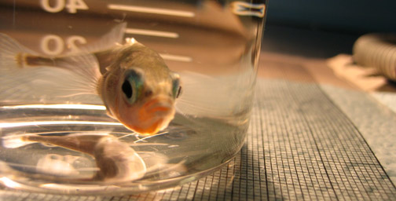

# Introduction to the Lab

We are an intellectual community of geneticists who specializes in quantitative evolutionary genomics. Our laboratory studies the developmental genetic and genomic basis of evolution in natural populations. We use the threespine stickleback and zebrafish as the main animal models in the laboratory, as well as syngnathid. We have produced some of the first work that has helped develop stickleback into a model for dissecting the genetic basis of natural variation. We have developed genomic tools such as sequenced Restriction site Associated DNA (RAD) tags that help geneticists apply Next Generation Sequencing (NGS) technologies to biomedical and evolutionary genetic problems. These techniques allow for the efficient identification of thousands of single nucleotide polymorphisms (SNPs) throughout the genomes of models and non-model organisms. We produced the first SNP whole genome-scan for selection in the stickleback genome, and we developed novel Maximum Likelihood (ML) analytical tools for NGS data. Computational biologists and computer scientists in our team have produced software packages for genomic analyses that are used by laboratories around the world for the analysis of big data problems. Our laboratory has developed protocols, best practices, and tools for RNA-seq based transcriptomic functional analyses.

_____________
