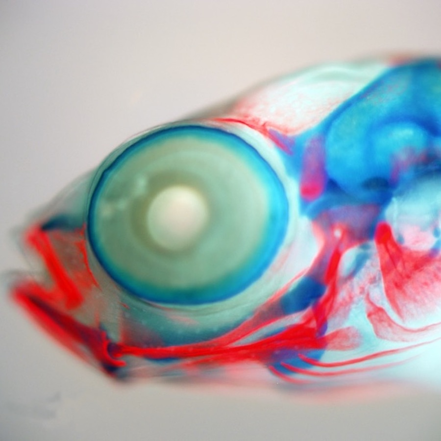

# Husbandry stickleback crossing

_____________

SOP - Fish Density Standards
(created by M Currey, August 25, 2011, updated by mcc 151125)

These standards for fish densities are what we in the Cresko lab have determined optimal after 12 years of keeping threespine stickleback in a recirculating aquaculture system.

Fry (9dpf - 2 months):

•	Fry are kept in 2.8 L tanks at an ideal density of 20 fish per container. Fry can be kept in densities of up to 40 fish per tank. If fish densities are near 40 per tank fish are transferred or thinned after 1 month of age. 

Juvenile (2 months - 4 months) Grow Out:

•	Juvenile fish are transferred from fry tanks into 9.5 L tanks and kept at a density of 20 fish per container. 

Grow out (4 months – 1 year), Adult (1 year - 1.5 years) and Breeding conditioning:

•	Grow out: Juvenile fish are transferred to 20 gallon tanks in the Winter room at an ideal density of 20 fish per container. Fish can be kept at a density of 40 fish per tank if space is needed. 
•	Breeding Conditioning: Once fish are 1 year of age (or older), transfer adult fish to the Summer room. Stickleback males become sexually mature 2-6 weeks after experiencing Summer conditions, females become sexually mature 4-6 weeks after experiencing Summer conditions conditions. Conditioned fish can stay in the Summer room for 5 months. 

_____________

