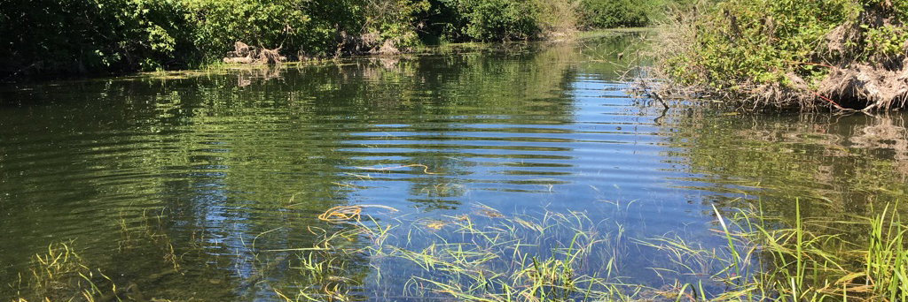

# Stickleback Husbandry - Recipes

_____________

## Embryo Medium 

### Material Needed: 
- Instant Ocean Salt
- Baking Soda
- npH2O

### Embryo Medium solution:
1.	Add 8g Instant Ocean to 2 liters of npH2O
2.	Add ~0.5g baking soda 
3.	Check pH and adjust to 7.0 – 8.0
4.	This makes 2 liters

* Salt and baking soda are located in containers near the dissecting scope. Rinse 2 liter flasks with DI water between uses. 
_____________

## MESAB 
*Tricaine must be pharmaceutical-grade. We use tricaine purchased from Pentair, manufactured by Western Chemical and FDA approved. Tricaine (3-amino benzoic acid ethyl lester also called ethyl m-aminoboenzoate) comes in a powdered form. Purchase the smallest amount possible because tricaine expires quickly.*

### Material Needed: 
- Mesab, a.k.a. MS222, tricaine, or 3-aminobenzoic acid ethyl ester
- 1 M Tris (pH 9)
- DD water

### Mesab Stock Solution (4g/L) (tris buffered):
- 1.	4 g tricaine powder
- 2.	979 ml DD water
- ~21 ml 1 M Tris (pH 9)
- Adjust pH to ~7	
- Aliquot in 50ml tubes, label with MESAB Stock Solution 4g/L, and store in a -20 freezer
- 	This makes 1 liter of solution.

### Euthanasia Solution (300 mg/L):

1.	Make a solution of tris buffered Stock Solution as described above. (Or obtain an aliquot from the freezer)
2.	Combine 7.5ml of stock solution into 100 ml of fish water. 

### Anesthesia (168 mg/L):

1.	Make a solution of tris buffered Stock Solution as described above. (Or obtain an aliquot from the freezer)
2.	Combine 4.2 ml of stock solution into 100 ml of fish water. 

_____________

## Testes Storage Solution 

### Materials Needed:

1.	NaCl
2.	KCl
3.	CaCl2
4.	NaHCO3
5.	npH2O
6.	Gentamycin (antimycotic) (Stock – 10mg/ml)*
7.	Cell Culture anti-biotic/mycotic from Gibco-BRL (15240-096) 100x Concentration*.

* Both of these reagents are located in separate boxes in Mark’s space in the 
- 20° C freezer. They are partitioned into 100μl aliquots. 

### Solutions: 

Ginzberg’s Ringers 
- Mix solids into 750 ml of npH2O
- 6.6g   NaCl
- 	0.25g KCl
- 	0.3g   CaCl2
- 	0.2g   NaHCO3
- 	Bring to 1 liter total volume with npH2O. 
- 	Store at 4° C.

### Testes solution (100ml)

•	Add 100μl of Gentamycin and 100μl of Anti-biotic/mycotic to 100ml of Ginzburg’s Ringers solution. 
•	Store at 4° C. 

