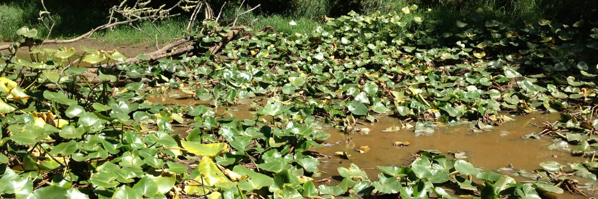

# Stickleback Husbandry - Equipment Maintenance

_____________

## Salt Vat Filling and Maintenance. 
(created by M Currey, August 25, 2011, updated 151201 by mcc)

### Purpose: 

This protocol is to be used to fill and maintain salt vats for dosing of saline solution into stickleback aquaculture systems.  

### Materials needed:

- Salt Vat
- Instant Ocean
- RO water 
- Air stone

### Procedure for filling:

1. When saline solution has reached the half mark, fill with RO water to the “fill” line. RO water is located near salt vats in both rooms. 
2. Add ¼ bucket of Instant ocean. 
3. Check that the vat is properly aerated (see below). 

### Procedure for maintenance (Should be performed every 6 months or more often if needed): 

1. Check that vat is properly aerated. Saline solution should be vigorously agitated. If vat is poorly aerated clear supply line, replace air stone, or both. 
2. Drain salt vat and thoroughly rinse with RO water to remove un-dissolved salt. Refill as described above. 

*Note: To turn dosing pump off (the yellow pump located above salt vat), position switch to the middle position. To turn on, position switch to the left position.* 

_________________________

SOP – Facility Maintenance - Weekly & Monthly 
(created by M Currey 5/6/08)

Material Needed:
•	Mop and broom
•	Sponges 
•	Bleach
Procedure:
Once per week:
•	Once per week the floors will be swept and mopped using a 10% bleach solution.
•	Once per week counter tops will be cleaned with sponge and a 10% bleach solution
•	Broken tanks are to be taken to the dumpster located at the northeast corner of Pacific Hall.
•	Dishes will be done daily (see plastic and glass cleaning SOP). 
Once per month:
•	Conductivity probe
•	pH probe
•	R.O. Carbon
•	Water pumps
•	Air pump
•	Salt Pump
Twice a year:
•	Change carbon filter left
•	Change carbon filter right
•	Salt vat maintenance 
Once a year:
1.	UV bulb
2.	RO membrane
3.	

__________________________

SOP – Net Autoclaving 
(created by M Currey 12/3/08) 

** For sanitizing nets and scrub pads that have been used in the fish room.

Procedure:
•	Place dirty nets and scrub pads in autoclave wire bin
•	Put bin into autoclave, and close the door (close door by pushing main door against hinge on left of door, then push door shut and seal by turning handle clockwise to just tight, DO NOT OVER TIGHTEN).
•	Change menu to B using keypad
•	Hit #1 twice, this will start the autoclave.
•	Sign sheet on outside of entrance door
•	Wait 45 minutes and remove nets
•	Put nets in clean nets tub.
•	Initial Check list on outside of door.   Gravity    45 min    OK to Remove

__________________________

SOP - Sentinel Fish Sampling
(created December 20, 2007, updated May 14th, 2008 by M Currey)

Materials: 
•	Dietrich’s fixative (see below for recipe)
•	50  ml tubes
•	Straight razor
•	Solutions
Prepare Dietrich's Fixative (100 ml) as follows:
   Mix in order:
-	30 ml Ethanol (95%)
-	10 ml Formalin (Formaldehyde 37% solution, histological grade, contains 10-  
-	15% methanol, Sigma # F1635)
-	2 ml Glacial Acetic Acid
-	58 ml Distilled Water
-	Store fixative at room temperature.

Procedure:
Sentinel tanks are placed in both the Summer and Winter rooms. One clutch of embryos is made and then divided. One half is put into the Winter room and the other is put into the Summer Room. Each tank should contain 10 –20 fish. Every 6 months four fish from each tank are samples. These fish will then be stained with Hematoxylin and Eosin and sectioned and mounted on slides by the Histology lab in Huestis Hall (contact – Poh King). Prepared slides are diagnosed by U of O attending vet, Kathy Snell 

Fixing of Fish and Sectioning:
Fish are euthanized using MS222. Cut 2cm segments starting just behind the eye to 2cm caudally. Put these segments into Dietrich’s fix for at least 24 hours. After 24 hours, cut segment bi-laterally leaving the spine. This is the piece that will be sent to histology.  Parafin embedded sagital sections need to be done. Sectioning only a few slices through 
the spinal cord.   

Poh King (Histology)
346-4923
$16/hr Blocks under 2cm take 1 –1&1/2hour

Dr. Kathy Snell
Attending Veterinarian 
Animal Care Services
5218 University of Oregon
Eugene, OR 97403-5218
P. 541-346-0998
F. 541-346-0588

ZIRC fish Vet
Katrina N. Murray, DVM, Ph.D.
Zebrafish International Resource Center
Pathology and Health Services
5274 University of Oregon
Eugene, OR 97403-5274
(541) 346-6028 ext. 14
Fax (541) 346-6151
fish_health@zebrafish.org

__________________________

SOP - Sump Maintenance 
(created 5/21/08 by M Currey)

Materials:
•	Pool vacuum
•	Clean building water with spray nozzle

Procedure:

Sumps are to be cleaned once a month or as needed. 

1.	Remove black matted cover of biobucket and take it to the trough. 
2.	Turn on clean water and wash cover until clean. 
3.	Return to sump and install drain cap and turn off valves to tanks of that rack. 
4.	Use the pool vacuum to clean debrie from bottom of sump.  
5.	Wash front plastic of sump with sponge (if cleaning clear sumps). Close valve, remove drain plug, open valves to tanks and move to the next sump or clean up. 

__________________________

SOP - RO Maintenance
(created December 14, 2011 m currey) 

For start up and more detailed info please refer to the manual. 

Determination of run time/day:
•	Run RO unit into container with known units of volume and determine the amount of time to fill desired volume. Determine the gallon per minute flow rate. If using a liter vessel; 3.8 liters = 1 gallon. 
•	The system is ~ 2000 gallons. Ideally we will want to change 5-10% of the water each day. This is 100-200 gallons. 
•	Set timer that RO unit is plugged into so that it is on the desired amount of time using the gallons/minute rate determined in step 1. 

** On 111214 the RO flow rate is ½ gallon/3 minutes. The timer was set to come on 6 hours/day split so that the RO comes on ~ 3X for 2 hours each time. 

Maintenance: 

 

Once a month or as needed:  
1.	Change and discard the pre-filter (city supply side) 
2.	Change and discard the first carbon block filter (middle position)
3.	Move the second carbon filter (closest to the machine) to the middle position 
4.	Install new carbon block in and put a new carbon block in third position

When the prefilter clogs the system will cycle on and off as the low pressure switch turns the unit off with low pressure but as soon as flow stops the pressure rebuilds and turns it back on.  This will destroy your pump and or motor and is very bad for the contacts in the pressure switch.  

Notes on Parts:  

I get the pump from Grainger ~$120
Procon pump, membranes, prefilters and carbon blocks from Pacific RO.  http://www.pacificro.com The guy's name is Bob and his prices are significantly lower than anything else I've found.  I just place a $2k order with him yesterday.

Applied Membranes inc www.appliedmembranes.com is another source I've used.

Craig from Oregon Water treatment just stopped buy and I'm buying new units from him.  He's matching Aquatic Eco's low prices, he's local and great to work with so I'm most likely going to be shifting all my business his way.

The tw30-2526 membranes for the hp 900 water factory is now a higher producing membrane twhp30-2526.  Makes more water.

Here are a few more bits and pieces for the units:

Water supply solenoid valve (tough to get, Oregon water treatment or Paramount supply):

 

If the water won't shut off, the orifice has gone bad.  Here's the one I'm working on right now.  11 years of soft water has eaten the brass away preventing the solenoid from shutting flow off.

Bad Orifice:
 

New Orifice
 

Carbonator motor:

 
 
http://www.grainger.com/Grainger/MARATHON-ELECTRIC-Carbonator-Pump-Motor-5U258

Clamp to connect motor to pump:
 
http://www.grainger.com/Grainger/PROCON-VBand-Clamp-11Z367?Pid=search

__________________________

SOP - UV filter bulb replacement and maintenance
(created December 14, 2011 m currey) 

Materials:
•	New UV bulbs - Stickleback system – 120 Watt
•	Gloves
•	High vacuum grease
•	Replacement Seals
•	Cloth for cleaning bulb housing
•	bucket

Bulb Replacement:

**Always wear gloves when handling UV bulbs as oils from your hands can ruin the bulb. 

•	Turn off power to UV filter 
•	Remove bulb by unscrewing plastic bulb bolt (grey threaded bolt at end of filter). 
•	Unplug bulb noting prong placement. 
•	Plug in new bulb with same prong placement as old bulb. 
•	Screw in bolt and UV. 
•	Turn power back on by plugging filter back in. 
•	Check to see that UV is working by looking for light through “viewing window” at the end of the filter. 
•	Update changed/next change needed sticker on outside of unit. 

Notes:
•	If bulb is not on it is probably because the prongs are incorrect. Take bulb back out and change the way the bulb is plugged in. 
•	Bulbs should be replaced once per year. 

Maintenance:

   ** This should be done when changing the bulb. 
1.	Isolate filter from main system by turning valves to shut off water to UV or turning off the water system. 
2.	Remove Bulb
3.	Drain UV filter by unscrewing bulb and other end caps from main housing. 
4.	Remove bulb housing and clean the outside of the hosing with a soft cloth, 
5.	Replace seals using grease on the seals. 
6.	Re-assemble bulb housing and install new bulb (see above). 
7.	Start unit and check to see that light is on and the unit is not leaking.
SOP - Carbon filter 
(created December 14, 2011 m currey) 

Backwashing:

** The black carbon filter is set to automatically backwash once every 99 days. 

For the BLACK carbon filter (Manual backwash): 
•	Press and hold up and down arrows for 4+ sec. This will initiate the manual backwash. 

For the BLUE carbon filter: 
•	Plug in filter. 
•	Twist large dial clockwise to “Backwash” position. The filter will now take itself through the backwash cycle. This takes about 30 – 40 minutes. When the cycle is done, unplug the filter. 
•	Label front of filter with time of backwash and when next backwash is needed. 

Filter Re-bed (activated carbon):
Materials: 
1.	Water hose to wash out used media
2.	Muck buckets
3.	Funnel
4.	Granular activated carbon (FilterWater.com, model #FM-GAC-01) 1 cu.
5.	Sand (Quickcrete model # 115251, coarse and washed)
6.	Duct tape

Procedure:
Disconnect Vessel
1.	Turn off water source
2.	Open valve to relieve pressure
3.	Disconnect vessel

Remove Carbon and Sand
1.	Unscrew head mechanism
2.	Position vessel on side near water hose
3.	Position muck bucket to catch media
4.	Spray water into vessel to remove carbon and sand
5.	Collect media and strain to remove water. Put used carbon into garbage sack and place in dumpster. 

Replace carbon and sand
1.	Dry top of riser and seal with duct tape
2.	Use funnel and add 4 inches of sand until top of riser is covered
3.	Add carbon to 18” below top of riser giving room for backwash mode. 

Reconnect vessel
1.	Remover duct tape. 
2.	Reconnect head control system (a little gasket grease may be needed to make a tight seal). 
3.	Reconnect vessel to plumbing
4.	Fill with water and allow it to sit overnight so that the carbon absorbs water. 
5.	Turn water on and initiate backwash cycle. 

__________________________

SOP - Programming Fish Room Lighting 
(created 3-20-2008 by M Currey)

Materials: 
	PC 
	Liason software and manual

Programming of fish room lighting regimes is done using the wall unit Grafik Eye 3000 and a PC. The unit is programmed in terms of scenes. Each scene specifies a lighting event, e.g. turning on the lights in one room over a 1/2 hour time period. Scenes are set at the control unit following the directions in the manual. Four scenes have been set up to turn off or on lighting in the main room and the breeding room. 

Procedure:
Scene 1: Main room ON with 30 min dawn. 

Scene 2: Main room OFF with 30 min dusk. 

Scene 3: Breeding room ON with 30 min dawn

Scene 4:  Breeding room OFF with 30 min dusk

Once the scenes are programmed you must tell the unit when to activate the scenes. This is done with a PC and Grafik Eye Liason software. If the software needs to be installed do so.  Connect the PC to the control unit. 

In EDIT MODE, 

•	Select control unit (I think that this unit is GRX3105)
•	Go to schedule (Not program) 
•	Drag scenes (upper right box) to desired times
•	Drag control unit (lower right box) to each scene
•	Be sure and copy schedule to the weekend
•	Go to FILE and establish communications via Online Options. 
•	After communications have been established go back to edit mode
•	Go to Online Options and select transfer data. This should program the wall unit when to activate scenes. 

__________________________
