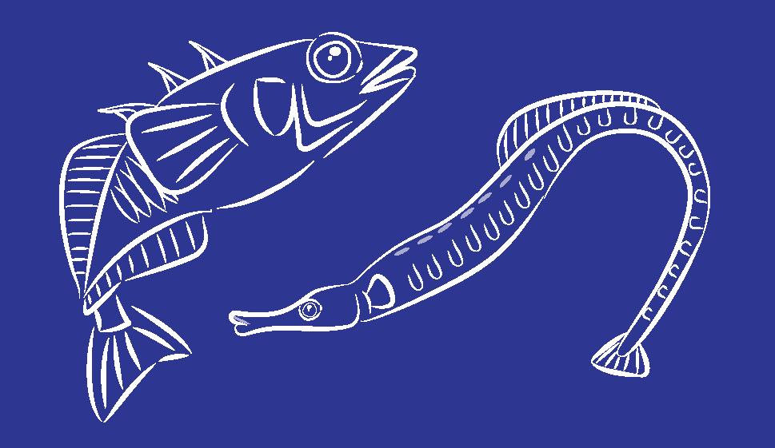
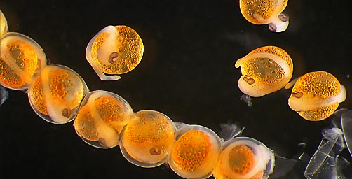

--- 
title: "Cresko Laboratory Manual"
author: "Cresko Lab"
date: "`r Sys.Date()`"
site: bookdown::bookdown_site
output: bookdown::gitbook
documentclass: book
bibliography: [book.bib, packages.bib]
biblio-style: apalike
link-citations: yes
description: "This is the Cresko Laboratory Manual"
---

# The Cresko Lab

Description of our laboratory

<!--chapter:end:index.Rmd-->

# Introduction to the Lab

We are an intellectual community of geneticists who specializes in quantitative evolutionary genomics. Our laboratory studies the developmental genetic and genomic basis of evolution in natural populations. We use the threespine stickleback and zebrafish as the main animal models in the laboratory, as well as syngnathid. We have produced some of the first work that has helped develop stickleback into a model for dissecting the genetic basis of natural variation. We have developed genomic tools such as sequenced Restriction site Associated DNA (RAD) tags that help geneticists apply Next Generation Sequencing (NGS) technologies to biomedical and evolutionary genetic problems. These techniques allow for the efficient identification of thousands of single nucleotide polymorphisms (SNPs) throughout the genomes of models and non-model organisms. We produced the first SNP whole genome-scan for selection in the stickleback genome, and we developed novel Maximum Likelihood (ML) analytical tools for NGS data. Computational biologists and computer scientists in our team have produced software packages for genomic analyses that are used by laboratories around the world for the analysis of big data problems. Our laboratory has developed protocols, best practices, and tools for RNA-seq based transcriptomic functional analyses.

<!--chapter:end:01-intro.Rmd-->

# Mission and Vision

We describe our methods in this chapter.

<!--chapter:end:02-mission_vision.Rmd-->

# Lab Expectations

## Scientific Ethics and Integrity

- xx
- xx
- xx

## Authorship of Manuscripts

**Recommended: At the start of each project, design your plan for authorship of the project so
everyone knows the expectations**

*Authorship criteria*:

1) Makes a significant intellectual contribution to research ideas and experimental design

OR

2) Makes a significant contribution to data acquisition, data generation, data analysis, data
interpretation, research coordination, and/or financial support of research

AND

3) Contributes to writing part of the manuscript, in addition to editing revisions before
submission for publication

AND

4) Remains involved throughout the submission and revision process until final publication

*Research participants not meeting the criteria should be listed in the Acknowledgments
section of the final published manuscript

*Authorship order*:

Generally, the person who had the most significant contribution to the project and who does
most of the writing will be the first author. In ecology, the last author is generally the PI of the
lab (although not always). The remaining authors are usually listed in their order of
contribution. However, if contributions were equivalent, then co-authors can be alphabetized
or ordered according to their time since involvement in the project.

<!--chapter:end:03-expectations.Rmd-->

# CRESKO LAB SAFETY PROTOCOLS

__FOR YOUR OWN SAFETY AND THE SAFETY OF OTHERS, HEED THE FOLLOWING RULES!__

EMERGENCY CONTACT: dial 911 first, _AND_  6-2919 (EHS) | Mark Cell 541-505-0006

**•** **Safety Shower, Eyewash, Fire Extinguishers.  Eyewashes must be flushed weekly. _Undergraduate research assistants are responsible for flushing the safety showers each week._ _Each lab member is responsible for knowing the locations of safety showers and fire extinguishers in the lab.  Safety showers and fire extinguishers are tested annually by EHS. 

## Wear a lab coat** **and closed-toed shoes** **when working with the following chemicals:**

- organics (e.g. phenol/chloroform, Trizol, DNAzol, formaldehyde, formamide, methanol)

- strong acids and bases

## Wear** **eye protection** **when working with:**

- UV light (UV opaque glasses/face shield) 

- phenol/chloroform, strong acids/bases, and any splash hazard with anything hazardous in it. 

## Wear safety gloves when working with ANY of the reagents above.

Heed the “one glove rule”: remove one glove when moving between rooms to avoid touching doorknobs with a contaminated glove. Note that glove materials differ in their permeability to different reagents. Standard nitrile gloves are adequate for our lab’s standard procedures. However, if you are planning experiments that involve more dangerous reagents, consult with Luke Sitts at EHS to select appropriate gloves.

## Disposal of common hazardous reagents (EHS DISPOSAL: 6-3192)**

- E. coli plates and recombinant materials: autoclave buckets or EHS biohazard incineration boxes

- E. coli flasks/liquids: bleach, rinse, drain

- Used alcohols, formaldehyde, and kit waste: waste containers under the thermocyclers.  

- organic solvents: waste bottles in hood. 

## Storage **of Hazardous Liquids**

- Store flammables and strong acids in a latched METAL SAFETY CABINET UNDER THE HOOD.

## Heating Liquids in the Microwave Oven**

Triple check that the cap is _very_ loose or (better) remove it entirely. Remelting of gels with DNA binding dyes is forbidden.

## Bunsen Burners**

- Triple check that the gas is shut completely off before you leave the bench/ hood. 

- keep burners far away from any flammable liquids. 

## Liquid Nitrogen and Dry Ice** 

- Use only in well ventilated spaces to avoid asphyxiation.  

- Never store in sealed containers to avoid explosions

- Wear lab coat, gloves, goggles. In case of frostbite or burn, soak affected part in tepid water, seek medical attention

<!--chapter:end:04-lab_safety.Rmd-->

# LONE WORKER GUIDELINES FOR LABORATORY PERSONNEL

The UO Laboratory Safety Advisory Committee (LSAC) feels that working alone in laboratories should be discouraged but recognizes that a prohibition would hinder the research and education missions of the UO. To advance personnel safety while also recognizing research needs, the LSAC developed this guidance document to assist lab workers in recognizing dangers and developing appropriate procedures.  

The primary danger in working alone is that if an accident should occur, there will be delays in rendering aid.   

Before working alone, you should:

1. Ensure that you have been trained on the procedures, reviewed the safety data sheets for all associate materials, and know the emergency procedures for your lab.
2. 	Consider whether the risk outweighs the benefits of working alone. 
3. 	Consider whether this work can be done at a time when others are around.
4. 	Consider using a buddy system with individuals in other labs nearby.   

If you decide to proceed with hazardous procedures on your own, please use a check-in or text-in system with supervisors or peers, ensuring that they know where and when this work is done and that they have contact information readily available for campus safety personnel. 

SPECIFIC GUIDELINES FOR THIS LABORATORY

Examples of materials and procedures in THIS laboratory that should be avoided while working alone are provided below. Should you choose to do lone work of this nature, ensure that others know where and when this work will be performed, and when it is completed.

Building & Room: _Pacific 310 & 324___ Supervisor: __Dr. William Cresko_

In this laboratory these chemicals or procedures will not be used or done while working alone: 

The use of phenol chloroform and the movement of glass aquariums will not be done while working alone in Pacific 310 or 324.   

In this laboratory, these procedures will not be conducted while working alone:

Procedures that require the use of phenol chloroform or the movement of glass aquariums

Other safety considerations for working alone in this laboratory (add pages as needed):

Emergencies – Dial 911 
Lab Safety Coordinator: 
Safety and Risk Services/EHS: 541-346-3192

<!--chapter:end:05-lone_work.Rmd-->

# IACUC

descriptions of animal care IACUC protocols

<!--chapter:end:12-IACUC.Rmd-->

# Recipes

_____________

## Embryo Medium 

### Material Needed: 
- Instant Ocean Salt
- Baking Soda
- npH2O

### Embryo Medium solution:
1.	Add 8g Instant Ocean to 2 liters of npH2O
2.	Add ~0.5g baking soda 
3.	Check pH and adjust to 7.0 – 8.0
4.	This makes 2 liters

* Salt and baking soda are located in containers near the dissecting scope. Rinse 2 liter flasks with DI water between uses. 
_____________

## MESAB 
*Tricaine must be pharmaceutical-grade. We use tricaine purchased from Pentair, manufactured by Western Chemical and FDA approved. Tricaine (3-amino benzoic acid ethyl lester also called ethyl m-aminoboenzoate) comes in a powdered form. Purchase the smallest amount possible because tricaine expires quickly.*

### Material Needed: 
- Mesab, a.k.a. MS222, tricaine, or 3-aminobenzoic acid ethyl ester
- 1 M Tris (pH 9)
- DD water

### Mesab Stock Solution (4g/L) (tris buffered):
- 1.	4 g tricaine powder
- 2.	979 ml DD water
- ~21 ml 1 M Tris (pH 9)
- Adjust pH to ~7	
- Aliquot in 50ml tubes, label with MESAB Stock Solution 4g/L, and store in a -20 freezer
- 	This makes 1 liter of solution.

### Euthanasia Solution (300 mg/L):

1.	Make a solution of tris buffered Stock Solution as described above. (Or obtain an aliquot from the freezer)
2.	Combine 7.5ml of stock solution into 100 ml of fish water. 

### Anesthesia (168 mg/L):

1.	Make a solution of tris buffered Stock Solution as described above. (Or obtain an aliquot from the freezer)
2.	Combine 4.2 ml of stock solution into 100 ml of fish water. 

_____________

## Testes Storage Solution 

### Materials Needed:

1.	NaCl
2.	KCl
3.	CaCl2
4.	NaHCO3
5.	npH2O
6.	Gentamycin (antimycotic) (Stock – 10mg/ml)*
7.	Cell Culture anti-biotic/mycotic from Gibco-BRL (15240-096) 100x Concentration*.

* Both of these reagents are located in separate boxes in Mark’s space in the 
- 20° C freezer. They are partitioned into 100μl aliquots. 

### Solutions: 

Ginzberg’s Ringers 
- Mix solids into 750 ml of npH2O
- 6.6g   NaCl
- 	0.25g KCl
- 	0.3g   CaCl2
- 	0.2g   NaHCO3
- 	Bring to 1 liter total volume with npH2O. 
- 	Store at 4° C.

### Testes solution (100ml)

•	Add 100μl of Gentamycin and 100μl of Anti-biotic/mycotic to 100ml of Ginzburg’s Ringers solution. 
•	Store at 4° C. 

<!--chapter:end:13-lab_recipes.Rmd-->

# Pipefish Husbandry Protocols

---------------

## Pipefish Feeding

(created by M Currey 7/23/09)

**Materials Needed:** 

- Decapsualted Brine Shrimp (see artemia decapsulations SOP)
- Adult Brine Shrimp
- Live Moina
- Frozen myisid Shrimp
- Live mysid shrimp
- Shrimp collector
- Squirt Bottle
- 
### Fish foods for fry, juvenile and adults:

- Fry - newly hatched baby brine shrimp (see hatching brine shrimp SOP), salt water copepods. Fry are fed once per day
- Adult – newly hatched brine shrimp, Adult brine shrimp, Moina. Adults are fed once per day. Feed adult brine shrimp when we have them. Use moina when we are out of adult brine shrimp. Adult brine shrimp are from a local fish store and are only available every tow weeks. They last ~ one week and therefore adult pipefish are fed adult brine shrimp for one week and moina the next. 

**Fry:**

         Fry tanks are designated with an orange dot. 

1. Newly hatched brine: Collect newly hatched brine and place into a squirt bottle (see brine shrimp SOP). Feed all tanks with an orange dot. 

**Adults:**

        Adult tanks are designated with a yellow dot. 

1. Newly hatched brine: Collect newly hatched brine and place into a squirt bottle (see brine shrimp SOP). Feed all tanks with an orange dot. 
1. Frozen Mysis: Obtain a quarter-sized piece of frozen mysis from the freezer. Place into squirt bottle and add water. Wait until mysis thaws and feed to all adult tanks. 
1. Adult Brine shrimp: Scoop out adult brine shrimp with net. Wash into a ball and place over the top of squirt bottle. Wash ball of brine into squirt bottle and feed all adult pipefish. 
1. Moina: Scoop out with net and wash into a ball. Invert ball over collection beaker and wash moina into beaker. Pour moina into squirt bottle and feed. 
1. Live Mysid: See live foods SOP

## **Live Food Culture, Monia and Mysid Shrimp:** 

**_Moina_**

**Materials:** 

- 10 gallon glass tanks
- corner sponge filter
- Air supply
- Rotifer diet
- Powdered nannochloropsis 

**Procedure:** 

- Fill 10 gallon tank 3/4 full of stickleback system water
- Add corner filter and activate with air. 
- Add Moina
- Change water once every 2-3 weeks by removing half of the water and replacing with stickleback water. 
- DO NOT break tank down and clean as moina do not respond well to this. 

**Feeding:** 

- Add 15 drops of rotifer diet and 1/8 scoop of powdered nannochloropsis each day. 

###### Collection and feeding to fish

- See pipefish feeding SOP

###### _Mysid Shrimp_

For a description of the mysid generator please visit: 

http://www.mblaquaculture.com/assets/docs/MBL_AQ_Mysid_Generator.pdf

**Materials:** 

- 10 gallon tank generator system
- Salt water

**Feeding:**

- Feed newly hatched brine shrimp daily to both adults and juveniles. 

**Water Change:**

- 2-3 times per week empty 5 gallons of water from the system and replace with new make up water. 
- Make new water in 5 gallon bucket by adding DI water and 2 scoops of salt. 

**Juvenile Collection (Daily):**  

- Turn off water to tanks. 
- Remove collection cup, using mysid system water, rinse juveniles into plastic container. 
- Pour juveniles into grow out tank.
- Replace collection cup. 
- Turn water on and start siphon. 

**Adults collection and feeding to pipefish:** 

Juvenile will reach adult size in three weeks. At three weeks these new adults will replace old breeding adults. The old breeding adults that are being replaced are feed to the pipefish. 

- Let juveniles grow to three weeks at which point they reach adult stage
- Siphon adults through a net and collect in a container. 
- Siphon old adults out of one of the 10 gallon tanks and feed to pipefish
- Clean tank, fill with water and add new adult. 

\newpage

## Live Food Culture, Monia and Mysid Shrimp: 

**_Moina_**

**Materials:** 

- 10 gallon glass tanks
- corner sponge filter
- Air supply
- Rotifer diet
- Powdered nannochloropsis 

**Procedure:** 

- Fill 10 gallon tank 3/4 full of stickleback system water
- Add corner filter and activate with air. 
- Add Moina
- Change water once every 2-3 weeks by removing half of the water and replacing with stickleback water. 
- DO NOT break tank down and clean as moina do not respond well to this. 

**Feeding:** 

- Add 15 drops of rotifer diet and 1/8 scoop of powdered nannochloropsis each day. 

###### Collection and feeding to fish

- See pipefish feeding SOP

###### _Mysid Shrimp_

For a description of the mysid generator please visit: 

http://www.mblaquaculture.com/assets/docs/MBL_AQ_Mysid_Generator.pdf

**Materials:** 

- 10 gallon tank generator system
- Salt water

**Feeding:**

- Feed newly hatched brine shrimp daily to both adults and juveniles. 

**Water Change:**

- 2-3 times per week empty 5 gallons of water from the system and replace with new make up water. 
- Make new water in 5 gallon bucket by adding DI water and 2 scoops of salt. 

**Juvenile Collection (Daily):**  

- Turn off water to tanks. 
- Remove collection cup, using mysid system water, rinse juveniles into plastic container. 
- Pour juveniles into grow out tank.
- Replace collection cup. 
- Turn water on and start siphon. 

**Adults collection and feeding to pipefish:** 

Juvenile will reach adult size in three weeks. At three weeks these new adults will replace old breeding adults. The old breeding adults that are being replaced are feed to the pipefish. 

- Let juveniles grow to three weeks at which point they reach adult stage
- Siphon adults through a net and collect in a container. 
- Siphon old adults out of one of the 10 gallon tanks and feed to pipefish
- Clean tank, fill with water and add new adult. 

<!--chapter:end:14-pipefish_husbandry_protocols.Rmd-->

# Histological Protocols

## Alizarin Staining

### PURPOSE: Alizarin staining of fixed adult stickleback.

### MATERIALS:

- 0.5% Alizarin red S Stock: To make 50 mls add 0.25g alizarin red S powder to 50 ml water.
- 0.025% Alizarin Stain: To make 100 mls: Add 500µl 0.5% alizarin red S (stock) to 99.5ml 1% KOH
- 1 Liter: Add 5ml 0.5% alizarin red S (stock) to 9950ml (1 liter) 1%KOH
- 3% H202/0.5%KOH: Mix and keep at 4C; Before using, bring to room temperature to hold down
- introducing bubbles under the skin: 0.5ml 6%H202 & 0.5ml 1%KOH.
- MESAB: Tricaine: 3-amino benzoic acid ethyl ester from Sigma (Cat \# A-5040). Mix in fish safe container with a stir bar:
	-   400 mg tricaine powder
	-   800 mg Na2HPO4 (anhydrous)
	-   100 ml glass distilled water

Adjust to \~pH 7 with a drop at a time of 1N NaOH or 1N HCl if needed
but it's usually right if you weigh the sodium phosphate carefully and
measure the water with a graduated cylinder.

For storage: Aliquot into 6 x 25 ml fish safe plastic bottles and store
at 4C. Label with date made and use within a couple of weeks.

8% PFA: {#pfa .subhead2}

-   8 g Pelleted PFA (Ted Pella, Inc.; cat\# 18501)
-   90 ml dH2O
-   25 drops 1N NaOH

1.  Heat at very low heat and stir until solution clears.
2.  Add 25 drops 1N HCl. pH should be 7.0-7.2.
3.  Filter and store at 4C not more than 1 week.
4.  Use as 4% PFA: dilute 1:1 with 2X PBS, do not store solution more
    than a few hours.

2X PBS {#x-pbs .subhead2}

-   1.6% NaCl
-   0.04% KCl
-   0.04 M PO4 pH 7.0- 7.3

### Procedure:

Day

Step

Time for Step

Date and Time

1

2h-8h at R/T depending on size on shaker.

1h or longer at R/T on shaker.

Without agitation and with lid open until eyes start to lighten and all
skin pigment is gone (usually about an hour or more)

2

2 h to O/N at R/T on shaker

2 h to overnight O/N at R/T on shaker.\
Check for bone staining.

R/T on shaker until excess stain in tissue is gone.

Without agitation

Wild caught specimens are put in 100% EtOH in the field and then
rehydrated and put into 4% when back in the lab.

<!--chapter:end:15-hist_protocols.Rmd-->

`r if (knitr:::is_html_output()) '
# References {-}
'`

<!--chapter:end:20-references.Rmd-->

