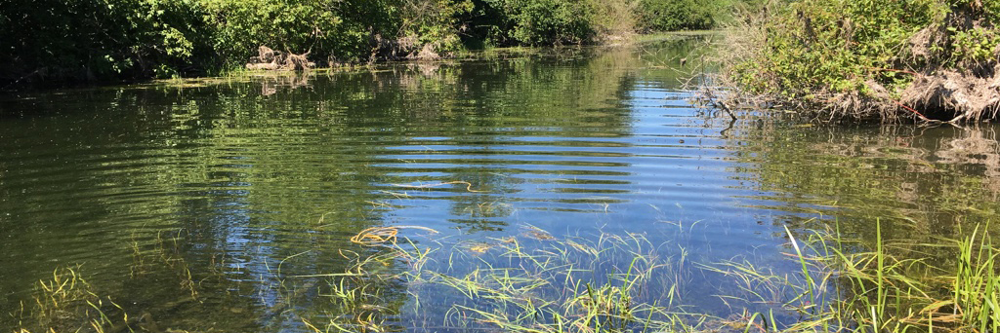
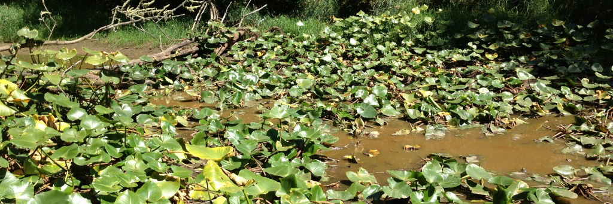

--- 
title: "Cresko Laboratory Manual"
author: ""
date: "`r Sys.Date()`"
site: bookdown::bookdown_site
output: bookdown::gitbook
documentclass: book
bibliography: [book.bib, packages.bib]
biblio-style: apalike
link-citations: yes
description: "This is the Cresko Laboratory Manual"
---

# The Purpose of this Manual

xxx Description of the purpose of the manual and how to use it XXX

<!--chapter:end:index.Rmd-->

# Introduction to the Lab

We are an intellectual community of geneticists who specializes in quantitative evolutionary genomics. Our laboratory studies the developmental genetic and genomic basis of evolution in natural populations. We use the threespine stickleback and zebrafish as the main animal models in the laboratory, as well as syngnathid. We have produced some of the first work that has helped develop stickleback into a model for dissecting the genetic basis of natural variation. We have developed genomic tools such as sequenced Restriction site Associated DNA (RAD) tags that help geneticists apply Next Generation Sequencing (NGS) technologies to biomedical and evolutionary genetic problems. These techniques allow for the efficient identification of thousands of single nucleotide polymorphisms (SNPs) throughout the genomes of models and non-model organisms. We produced the first SNP whole genome-scan for selection in the stickleback genome, and we developed novel Maximum Likelihood (ML) analytical tools for NGS data. Computational biologists and computer scientists in our team have produced software packages for genomic analyses that are used by laboratories around the world for the analysis of big data problems. Our laboratory has developed protocols, best practices, and tools for RNA-seq based transcriptomic functional analyses.

_____________

<!--chapter:end:01-intro.Rmd-->

# Mission and Vision

We describe our methods in this chapter.

<!--chapter:end:02-mission_vision.Rmd-->

# Lab Expectations

## Scientific Ethics and Integrity

- xx
- xx
- xx

## Authorship of Manuscripts

**Recommended: At the start of each project, design your plan for authorship of the project so
everyone knows the expectations**

*Authorship criteria*:

1) Makes a significant intellectual contribution to research ideas and experimental design

OR

2) Makes a significant contribution to data acquisition, data generation, data analysis, data
interpretation, research coordination, and/or financial support of research

AND

3) Contributes to writing part of the manuscript, in addition to editing revisions before
submission for publication

AND

4) Remains involved throughout the submission and revision process until final publication

*Research participants not meeting the criteria should be listed in the Acknowledgments
section of the final published manuscript

*Authorship order*:

Generally, the person who had the most significant contribution to the project and who does
most of the writing will be the first author. In ecology, the last author is generally the PI of the
lab (although not always). The remaining authors are usually listed in their order of
contribution. However, if contributions were equivalent, then co-authors can be alphabetized
or ordered according to their time since involvement in the project.

<!--chapter:end:03-expectations.Rmd-->

# Cresko Lab Safety protocols

__FOR YOUR OWN SAFETY AND THE SAFETY OF OTHERS, HEED THE FOLLOWING RULES!__

EMERGENCY CONTACT: dial 911 first, _AND_  6-2919 (EHS) | Mark Cell 541-505-0006

**Safety Shower, Eyewash, Fire Extinguishers.**  

Eyewashes must be flushed weekly. _Undergraduate research assistants are responsible for flushing the safety showers each week._ _Each lab member is responsible for knowing the locations of safety showers and fire extinguishers in the lab.  Safety showers and fire extinguishers are tested annually by EHS. 

**Wear a lab coat and closed-toed shoes when working with the following chemicals:**

- organics (e.g. phenol/chloroform, Trizol, DNAzol, formaldehyde, formamide, methanol)
- strong acids and bases

**Wear eye protection when working with:**

- UV light (UV opaque glasses/face shield) 

- phenol/chloroform, strong acids/bases, and any splash hazard with anything hazardous in it. 

**Wear safety gloves when working with ANY of the reagents above.**

Heed the “one glove rule”: remove one glove when moving between rooms to avoid touching doorknobs with a contaminated glove. Note that glove materials differ in their permeability to different reagents. Standard nitrile gloves are adequate for our lab’s standard procedures. However, if you are planning experiments that involve more dangerous reagents, consult with Luke Sitts at EHS to select appropriate gloves.

**Disposal of common hazardous reagents (EHS DISPOSAL: 6-3192)**

- E. coli plates and recombinant materials: autoclave buckets or EHS biohazard incineration boxes

- E. coli flasks/liquids: bleach, rinse, drain

- Used alcohols, formaldehyde, and kit waste: waste containers under the thermocyclers.  

- organic solvents: waste bottles in hood. 

**Storage of Hazardous Liquids**

- Store flammables and strong acids in a latched METAL SAFETY CABINET UNDER THE HOOD.

Heating Liquids in the Microwave Oven**

Triple check that the cap is _very_ loose or (better) remove it entirely. Remelting of gels with DNA binding dyes is forbidden.

**Bunsen Burners**

- Triple check that the gas is shut completely off before you leave the bench/ hood. 

- keep burners far away from any flammable liquids. 

**Liquid Nitrogen and Dry Ice** 

- Use only in well ventilated spaces to avoid asphyxiation.  

- Never store in sealed containers to avoid explosions

- Wear lab coat, gloves, goggles. In case of frostbite or burn, soak affected part in tepid water, seek medical attention

## Lone Worker Guidelines

The UO Laboratory Safety Advisory Committee (LSAC) feels that working alone in laboratories should be discouraged but recognizes that a prohibition would hinder the research and education missions of the UO. 

To advance personnel safety while also recognizing research needs, the LSAC developed this guidance document to assist lab workers in recognizing dangers and developing appropriate procedures.  

The primary danger in working alone is that if an accident should occur, there will be delays in rendering aid.   

### Before working alone, you should:

1. Ensure that you have been trained on the procedures, reviewed the safety data sheets for all associate materials, and know the emergency procedures for your lab.
2. Consider whether the risk outweighs the benefits of working alone. 
3. Consider whether this work can be done at a time when others are around.
4. Consider using a buddy system with individuals in other labs nearby.   

If you decide to proceed with hazardous procedures on your own, please use a check-in or text-in system with supervisors or peers, ensuring that they know where and when this work is done and that they have contact information readily available for campus safety personnel. 

### Specific Guidelines for the Cresko Lab

Examples of materials and procedures in THIS laboratory that should be avoided while working alone are provided below. Should you choose to do lone work of this nature, ensure that others know where and when this work will be performed, and when it is completed.

**Building & Room**:  *Pacific 310 & 324*    
**Supervisor**: *Dr. William Cresko*

**In this laboratory these chemicals or procedures will not be used or done while working alone:** 

*The use of phenol chloroform and the movement of glass aquariums will not be done while working alone in Pacific 310 or 324.*   

**In this laboratory, these procedures will not be conducted while working alone:**

*Procedures that require the use of phenol chloroform or the movement of glass aquariums*

**Other safety considerations for working alone in this laboratory:**

*Emergencies – Dial 911* 
*Lab Safety Coordinator:* 
*Safety and Risk Services/EHS: 541-346-3192*

<!--chapter:end:04-lab_safety.Rmd-->

# Stickleback Husbandry - Health

_____________

## Health Check - Sick and Dead Fish 
(created 4/14/08 by M Currey, updated 151201 by mcc)

*Check for sick and dead fish Daily by looking through all tanks. This is best done when feeding.  When done initial checklist and email Mark (see announcement below). Symptoms of Sick and Distressed fish are posted in the fish room.

Material Needed: 
•	Fish Morgue consisting of a small bucket with lid and a sealable plastic bag
•	Mesab, a.k.a. MS222, tricaine or 3-aminobenzoic acid ethyl ester
•	Small container
•	Net

If dead fish is found:

1.	Make note of the number of fish, tank space, and what stock the fish was from on the daily check list. 
2.	With a clean net, remove fish and place into fish morgue. (The fish morgue can be found in the chest freezer. It is a small bucket labeled “Fish Morgue” on the lid). 

If sick fish is found: 

1.	Make note on tank and contact supervisor. 

Please email Mark with a list of all sick and dead fish along with tank position at the end of each shift, mcurrey@uoregon.edu.

If there are numerous sick or dead fish please contact Mark Currey 541-505-0006 or Bill Cresko 541-285-5446 immediately. 

_______________

## Adult fish Anesthesia, Euthanasia, and Fixation  
(created 4/14/08 by M Currey, updated 151201 by mcc)

** Tricaine must be phamaceutical-grade. (We use tricaine purchased from Aquaic Ecosystems, manufactured by Western Chemical and FDA approved)
These procedures are to be done on fish larger then 5mm in length. 

### Material Needed: 
•	Fish Morgue consisting of a small bucket with lid and a sealable plastic bag
•	Mesab, a.k.a. MS222, tricaine or 3-aminobenzoic acid ethyl ester
•	Small container
•	Net

### Mesab Stock Solution (4g/L)(From Zebrafish Book 4th edition):
Tricaine (3-amino benzoic acid ethy lester also called ethyl m-aminoboenzoate) comes in a powdered form from Sigma (Cat.# A-5040). It is also available as Finquel (Part No. C-FINQ-UE) from Argent Chemical Laboratories, Inc. 

1.	Make tricaine solution for anesthetizing fish by combining the following in a glass bottle with a screw cap:

•	Stock Solution (4g/L)
•	400 mg tricaine powder
•	97.9 ml DD water
•	~2.1 ml 1 M Tris (pH 9)

2.	Adjust pH to ~7. Store this solution in the freezer. (Buy the smallest amount possible because tricaine gets old.)

### Euthanasia (300 mg/L):

Procedure:
1.	Make a solution of tris buffered Stock solution MS-222 solution as described above. (Or obtain solution from freezer)
2.	Combine 7.5ml of stock solution into 100ml of fish water. 
3.	Place fish into above fish water/ mesab solution for at least 10 minutes after cessation of opercular movement ~12 minutes. 
4.	If fish is to be used for experiments, proceed with fixation or preparation of the experiment. 
5.	If the fish are to be disposed of, place fish into fish morgue located in chest freezer in entry room. 

### Anesthesia (168 mg/L):

1.	Make a solution of tris buffered Stock solution MS-222 solution as described above. (Or obtain solution from freezer)
2.	Combine 4.2 ml of stock solution into 100ml of fish water. 
3.	Place fish into 168 mg/l MS-222 solution and wait for the fish to slow down. 
4.	Image or do other experiments quickly to minimize fish exposure to MS-222. Pay attention to opercular movement to be sure that fish is alive. 
5.	Revive by placing in fish water and moving fish gently through the water to pass water over gills. 

### Liquid N2 freezing, and fixation in RNAlater:

1.	Anesthetize using above concentration of MS-222 and allow fish to lay motionless with only slight opercle movement. This should take approximately 10 minutes. 
2.	Place fish in liquid N2 for 2 minutes. This instantaneously freezes the fish. 
3.	Thaw into RNAlater-ICE. 

SOP - Embryo and Larval Euthanasia and Fixation 
(created 4/6/10 by M Currey)

These procedures are to be done with larval fish and fish up to 5mm in length. 

For Euthanasia:

Materials:
•	Fish Morgue
•	Ice bath with basket (see below)
Procedure:
1.	Place ice in insulated box, e.g. cooler or Styrofoam container. 
2.	Add water to make ice slurry
3.	Add mesh basket so that ice water is allowed to enter but ice does not. 
4.	Place embryos in ice water
5.	Let embryos sit for 5 hour minimum
6.	Dispose of dead embryos in fish morgue. 

For RNA extraction:

Materials:
•	RNAlater (Ambion cat # AM7021) or –80 freezer
•	1.5 ml tubes
•	liquid nitrogen

Procedure:
RNA later
1.	Add RNA later per manufacturers recommendations. 
2.	Place embryos in solution. This rapidly fixes embryos. 
For Storage in -80° C Freezer
1.	Place embryos in 1.5 ml tube
2.	Put tube in liquid nitrogen for 2 minutes. 
3.	Place tube in –80° C for RNA extraction

For insitu hybridization:

Materials:
•	4% buffered PFA
       To make 100 ml of 4% PFA:
3.	Preheat to 60° C while stirring on heat plate
4.	Add 4 g PFA
5.	
Heat and stir just until solution clears. Do not let heat go above 60° C! pH should be about 7.4
6.	Store 10ml aliquots at -20C in 1.5 ml tubes

•	1.5 ml tubes
•	10 ml 10XPBS
•	90 ml sterile H2O

Procedure for fixing:
1.	Place embryos in 1.5 ml tube
2.	Add 1 ml 4%pfa
3.	Store in –20 freezer. 
       **This rapidly fixes embryos for insitu hybridization. 

<!--chapter:end:09-stickleback_husbandry_health.Rmd-->

# Stickleback Husbandry - General

_____________

+++

## Fish Density Standards
(created by M Currey, August 25, 2011, updated by mcc 151125)

These standards for fish densities are what we in the Cresko lab have determined optimal after 12 years of keeping threespine stickleback in a recirculating aquaculture system.

### Fry (9dpf - 2 months):

•	Fry are kept in 2.8 L tanks at an ideal density of 20 fish per container. Fry can be kept in densities of up to 40 fish per tank. If fish densities are near 40 per tank fish are transferred or thinned after 1 month of age. 

### Juvenile (2 months - 4 months) Grow Out:

•	Juvenile fish are transferred from fry tanks into 9.5 L tanks and kept at a density of 20 fish per container. 

Grow out (4 months – 1 year), Adult (1 year - 1.5 years) and Breeding conditioning:

•	Grow out: Juvenile fish are transferred to 20 gallon tanks in the Winter room at an ideal density of 20 fish per container. Fish can be kept at a density of 40 fish per tank if space is needed. 
•	Breeding Conditioning: Once fish are 1 year of age (or older), transfer adult fish to the Summer room. Stickleback males become sexually mature 2-6 weeks after experiencing Summer conditions, females become sexually mature 4-6 weeks after experiencing Summer conditions conditions. Conditioned fish can stay in the Summer room for 5 months. 

+++

_____________

## Juvenile Collection (Daily):  

1.	Turn off water to tanks. 

2.	Remove collection cup, using mysid system water, rinse juveniles into plastic container. 

3.	Pour juveniles into grow out tank.

4.	Replace collection cup.

5.	Turn water on and start siphon. 

## Adult mysid collection and feeding: 

1.	Juvenile will reach adult size in three weeks. At three weeks these new adults will replace old breeding adults. The old breeding adults that are being replaced are feed to the pipefish. 

2.	Let juveniles grow to three weeks at which point they reach adult stage.

3.	Siphon adults through a net and collect in a container.

4.	Siphon old adults out of one of the 10 gallon tanks and feed to fish.

5.	Clean tank, fill with water, and add new adult mysids. 

<!--chapter:end:10-stickleback_husbandry_general.Rmd-->

# Stickleback Husbandry - Crossing

_____________

SOP - Fish Density Standards
(created by M Currey, August 25, 2011, updated by mcc 151125)

These standards for fish densities are what we in the Cresko lab have determined optimal after 12 years of keeping threespine stickleback in a recirculating aquaculture system.

Fry (9dpf - 2 months):

•	Fry are kept in 2.8 L tanks at an ideal density of 20 fish per container. Fry can be kept in densities of up to 40 fish per tank. If fish densities are near 40 per tank fish are transferred or thinned after 1 month of age. 

Juvenile (2 months - 4 months) Grow Out:

•	Juvenile fish are transferred from fry tanks into 9.5 L tanks and kept at a density of 20 fish per container. 

Grow out (4 months – 1 year), Adult (1 year - 1.5 years) and Breeding conditioning:

•	Grow out: Juvenile fish are transferred to 20 gallon tanks in the Winter room at an ideal density of 20 fish per container. Fish can be kept at a density of 40 fish per tank if space is needed. 
•	Breeding Conditioning: Once fish are 1 year of age (or older), transfer adult fish to the Summer room. Stickleback males become sexually mature 2-6 weeks after experiencing Summer conditions, females become sexually mature 4-6 weeks after experiencing Summer conditions conditions. Conditioned fish can stay in the Summer room for 5 months. 

_____________

## Embryo Bleaching for Disinfection
(created by M Currey, August 25, 2011, updated 151201 by mcc)

### Purpose:
This protocol allows the removal of ecto-parasites from embryos produced from wild-caught stickleback. Use this protocol whenever new fish are added to a pre-existing stickleback rearing system, or whenever stocks are transferred between labs. 

### Materials needed:
•	Wash bottle and petri dishes
•	Timer

## Solutions
•	 6% sodium hypochlorite (standard bleach)
•	 Working stock of bleach – 500µl of bleach into 1 liter of embryo medium (see rearing protocols)

## Procedure:
1.	 Raise embryos according to standard crossing and rearing protocols (see husbandry SOP)

2.	 At 48-60 hours post-fertilization (@ 20C – at this point most organogenesis is complete) remove embryo medium from petri dishes and rinse embryos once with fresh embryo medium.

3.	 Fill petri dish with working stock solution of bleach.  Swirl and let sit for 1.5 min. Do not bleach embryos for longer as chorions can thicken and it becomes difficult for embryos to hatch.

4.	 Drain bleach solution from embryos, and wash them three times with fresh embryo medium.  This is really important.

5.	 Replace embryo medium daily.  If crosses are done in the field, the embryos can be shipped from day 3 to day 6 post-fertilization.  To ship embryos, rinse once with embryo medium, place embryos into a 50ml conical tube (~100 embryos/tube) and fill with fresh embryo medium.  Place tubes in a shipping container with wet ice.  Separate the tubes from the ice with bubble-wrap and newspapers.  Ship the embryos overnight.  

6.	 When the embryos arrive at the lab, rinse the outside of the containers well before moving into the lab.  Allow them to equilibrate to room temp (~20C).  Place the embryos into petri dishes, rinse once, and add new embryo medium.  Rear according to standard protocol.

_____________

## SOP – Testes Storage
(created by M Currey, August 25, 2011, updated 151201 by mcc)

### Purpose: Storage of stickleback testes for fertilization up to 1-2 months post extraction. 
Materials needed:
•	Testes solution
•	15 ml falcon tube
•	4C refrigerator 

### Procedure:

1.	Dissect testes (see Stickleback crossing SOP).
2.	Place testes in 15 ml tube with ~ 10 ml of testes solution. 
3.	Label tube with stock number and date of testes dissection and place tube with testes in 4C refrigerator. 
4.	Change testes solution once per week. 

Note: Testes can be used up to ~ 1 month when stored this way. 

_____________

## Egg Storage
(created by M Currey, August 25, 2011, updated 151201 by mcc)

### Purpose: Storage of eggs for fertilization up to 24 hours post stripping. 
Materials needed:
•	NaCl
•	KCl
•	CaCl2
•	NaHCO3
•	Tris, pH 7.2
•	npH2O
•	Streptomycin & Penicillin  Solution (PenStrep) from Sigma (P-0906) Stock – 100%
•	50 ml sterile polypropylene conical tubes
•	90 mm petri dish

### Procedure:

1.  Make stock of Holtfreiter’s Solution, store at 4C

      Mix solids into 750ml of npH2O
	3.5 gm NaCl
	0.05 gm KCl
	0.1 gm CaCl2
	0.02 gm NaHCO3
	1.0 ml Tris
	Bring to 1 liter with npH2O

2.  Add PenStrep to a final concentration of 1% (10ml into 1 liter), store at 4C.

3. Strip eggs from ripe female into a conical tube with 25ml cold Holtfreiters.

4. Eggs can be transported on ice and fertilized up to 24 hours later (maybe longer).

5. To fertilize, move eggs to 90mm petri dish and allow temperature to equilibrate to 20C.

6. Remove Holtfreiter’s solution, and rinse eggs once with embryo medium (important to.
     make sure that salt concentration is low enough for sperm to be optimally activated).

7.  Add macerated testis as in general husbandry SOP and cover eggs with embryo medium. 
SOP - Live Food Culture, Moina and Mysid Shrimp: 
(updated 151201 by mcc)

________________

## Stickleback Crossing 
(Created 4/1/08 by M. Currey)
### Materials Needed: 
•	25, 45 and 90mm disposable sterile petri dishes (standard)
•	Sterile Ginzburg’s Fish Ringers solution containing antibiotic and antimycotics for testes (see Testes Solution recipe)
•	MS222 Tricaine Methanesulfonate (see Mesab recipe)
•	100% ethanol
•	Fine scissors and forceps
•	Wide-blade entomology forceps
•	Sterile Embryo medium (6ml of Instant Ocean into 1L npH2O) 
•	Squeeze wash bottles
•	Stress coat (standard from pet store)
•	Sterile flat razor blades
•	Sterile disposable large bore transfer pipettes (VWR cat# 691)
•	Dissecting microscope

1.	Squeeze Female: Cover fingers with stress coat and gently squeeze gravid female. Gravid females have extended abdomens and their eggs have “dropped”.  If eggs do not emerge with very slight pressure the female is not quite ready. Squeeze eggs with motion from pectoral girdle posterior to the cloaca into a 25mm sterile petri dish. The small size of petri dish allows the sperm to be concentrated on the eggs. 
2.	Dissect Testes From Male: Euthanize male by placing him into a finger bowl of embryo medium containing a lethal volume of MS222. Clean a large, 30cm by 60cm or similar size, glass sheet, fine scissors, and forceps with 100% ethanol. When male is motionless, remove and rinse fish with clean water and sever spinal cord behind skull using a razor to be sure of euthanization. Use scissors to make incision just posterior to the cloaca and cut from there anteriorly to the pelvic girdle making an incision along the mid line of the fish. Make another cut to each side of the fish from the cloaca dorsally approximately 15mm so that the body cavity is easily accessed. Incisions should be made just deep enough to cut the skin and body wall muscle while being wary to not cut into the stomach and intestines that are located just below the skin surface. Locate paired testes and vas deferens (testes are variable in shape and coloration, but are usually long and pigmented, usually having the same pigmentation as the skin surface, and sit in the dorsal part of the coelom near the kidneys. The vas deferens are threadlike and are usually as long as the testis to which it connects. Use fine forceps to grab vas deferens, sever near the cloaca, and remove one (or often) both testes. Doing so keeps the testes intact, allowing them to contain viable sperm for up to 1 month at 4°C in Testes Solution. 
3.	Storing of Testes: If only a single cross is to be made with a male, proceed to step 4. Otherwise, place testes into 45mm petri dish filled with cold Testes Solution. Store testes at 4°C. To store testes for extended periods, change out medium once a week. 
4.	Prepare Testis: If multiple crosses are to be performed from a single pair of male’s testes, remove one testis and place on the inside lid of the 25mm petri dish into which a females eggs have been squeezed. Using a sterile razor, slice off a small piece of testis (we’ve found a large testis can be used to fertilize approximately 5 clutches). Make cuts as perpendicular as possible to the major axis of the testis and perform multiple cuts from the same end. This allows as much of the sperm to remain packaged and inactivated at the center of the testis. Use blade to macerate testis. Under a dissecting scope swimming sperm should cause a ‘sparkling’ refraction. Add approximately 1.0 ml of sterile embryo medium to testis prep with disposable pipette, mix, and then add to the eggs one drop at a time, using same disposable pipette, dispersing drops between petri dishes so that all eggs are covered with sperm mixture. 
5.	Fertilization (time = 0): Fertilization of most eggs will occur almost instantaneously. However, I leave the sperm on the eggs for about 5-10 minutes. At this point cover embryos with embryo medium. Mark fertilization time (this is the time that the initial drops of sperm were added) on the surface of the petri dish. Place in incubator at 20°C.
6.	Separation of Embryos and Second Cleaning (t = 2 hr): The animal pole of the embryo is established at the site of sperm entry, and at 20°C the first cell syncitium is usually visible within 45 minutes. The first cell division usually occurs approximately 25 minutes later, and the two cell stage is fully visible approximately 1.5hr after fertilization. During this time, the chorion thickens and attaches to the petri dish as well as to other embryos. At or after 2 hours post fertilization, use the wide blade entomological forceps to detach the embryos from one another, as well as to dislodge embryos from the bottom of the petri dish. Remove all of the unfertilized eggs to limit mold contamination, and record the total number of eggs and embryos. Rinse embryos 3 to 4 more times then distribute embryos to 90mm petri dishes (30-50 embryos per dish) filled half way with fresh embryo medium. Enter cross information into database, print labels for dishes, and place embryos into incubator at 20°C. 
7.	Raise Embryos (check daily): Embryos will develop at approximately 2.5 times zebrafish time [see http://zfin.org/zf_info/zfbook/stages/index.html], and hatch at approximately 7 days. 48hr stickleback embryos have completed most major morphogenetic processes, and the melanic pigment cells are just starting to migrate. A beating heart can be seen after ~72hr. Check petri dishes daily and remove those that have arrested development. A change of embryo medium may help at some point during the first 7 days as water quality may decline.

__________

## Incubator Use and Care of Stickleback Fry
(Created 4/1/08 by M. Currey)

### Purpose:
Researchers are responsible for monitoring and caring of their research animals while in the incubator. This includes water changes, removing “deads”, fixing, euthanizing and any other procedures regarding the fish. If the fish are to be raised past hatching please contact Mark, prior to hatching, to make arrangements for putting fish into system. Also, please see Mark prior to initial use of incubator for brief training. 

### Materials needed:
•	Petri Dishes 
•	Embryo Medium (found above incubator)
•	Incubator
•	Fry food
•	checklist

###  Procedure:
Raise Embryos (check daily):
Embryos will develop at approximately 2.5 times zebrafish time [see http://zfin.org/zf_info/zfbook/stages/index.html], and hatch at approximately 7 days. 48hr stickleback embryos have completed most major morphogenetic processes, and the melanic pigment cells are just starting to migrate. A beating heart can be seen after ~72hr. Check petri dishes daily and remove deads and those with arrested development. A change of embryo medium may help at some point during the first 7 days as water quality may decline.

Hatching, Begin Feeding Brine Shrimp, and Move to System (t = 7-8 days post fertilization): After hatching at 7-8 days post fertilization, remove chorions and allow young to absorb yolk (2-3 days). At approximately day 2 post hatching take petri dish containing fry out of incubator and place dishes on a table. To each petri dish add approximately the same volume of system water, as there is embryo medium; this will double the volume of liquid in the dish. This acclimates the fry to the system water. Allow the fry to acclimate for 6-10 hours, the longer the better. Then transfer fry to small aquaria on the system. Feed newly hatched brine shrimp once daily and fry food once daily according to directions posted in the fish room.

•	Initial checklist and add what type of check was done to checklist.

<!--chapter:end:11-stickleback_crossing.Rmd-->

# Stickleback Husbandry - Feeding

_____________

## Stickleback Feeding 
(created May 6, 2008 by m currey, revised October 21, 2014 by mcc)

### Materials:
- Fish food mix or dry fry food
- Decapsulated Artemia (see artemia decapsulating SOP)
- Color coded feeding Spoon

### Fish foods for fry and juvenile/adults:
- Fry - newly hatched baby brine shrimp (see hatching brine shrimp SOP) and Zeigler Larval Diet (Larva "Z" Plus 250-450 Microns).
- Juvenile and Adult fish food mix (see fish food mix SOP). 

*Dry Foods Are Stored in freezer in the stickleback facility*

_Procedure:_
- Fry are located along the south wall of the summer room. 
- AM feeding: Feed fry once per day with newly hatched brine shrimp (this should happen during the opposite feeding of larval diet)
- PM feeding: Feed fry once per day with Ziegler larval diet 1/8 spoon full. 
- Juvenile and Adults are located in the 20 gallon tanks in the Summer and Winter rooms. Additionally, individualized adults are sometimes located on the fry rack in the Summer room. Please check white board for notification of adults on fry rack. 
	- 	Feed juveniles and adults twice per day with dry food mix. Using the color coding on spoon, food mix, and tags on tanks. (e.g. for adults: use the red spoon, red food mix, and feed the tanks with a red tag). 
		- 		Unused brine shrimp can be fed to juvenile and adult fish. 

### Food Storage and Handling:
- See Fish food storage SOP. 

*Initial daily check list after you have fed. *

_____________

## Fish Food Mix
(created August 25, 2011 m currey)

### Materials:
- Freezer
- Fridge
- 1 gallon bucket with a tight seal
- plastic measuring cup

### Dry Mix:
- Mix the following dry foods in 1 gallon bucket

### Juvenile Mix: 
- 4 cups Pentair finfish starter ZC1 
- 1 cup New Life Spectrum optimum saltwater flake
- 1 cup Ziegler AP100

### Adult mix: 
- 4 cups Pentair finfish starter ZP1 
- 4 cups Pentair finfish starter ZC1 
- 1 cup New Life Spectrum grow
- 1 cup New Life Spectrum optimum saltwater flake
- 1 cup Hikari micro pellet
- 1 cup Hikari marine S
- 1/8 cup golden pearls

### Storage: 

- Label with expiration date (6 months after making) and store at  -20°C. 

_____________

## Fish Food: Storage and Sources
(created by M Currey, August 25, 2011)

*Label all foods with received date and expiration date 
(see below for how to determine expiration date).*

### Brine Shrimp: 

Good indefinitely if frozen in tightly sealed container

1 Upon receiving label with received date.
Store unopened tins in -20°C freezer. 
After de-capsulation label with date de-capsulated and date of expiration (30 days from de-capsulation). 
Store de-capsulated shrimp at 4°C.  

Source – Brine Shrimp Direct, www.brineshrimpdirect.com

### Golden Pearl Larval Diet: 
 
1.	800 – 1000 micron

Good 3-5 years if kept in freezer

1.	Store in -20°C freezer.
2.	Unopened label with expiration date 3 years from receiving date. 
3.	Upon opening change expiration date to 6 months from date opened.

Source – Brine Shrimp Direct,  www.brineshrimpdirect.com

### Hikari dry foods:

•	Marine S 
•	Micro Pellets 

If un-opened, expiration date is labeled on container by manufacturer. Once opened the food is good for 6 months. 

1.	Keep out of direct sunlight, high heat, and humidity.
2.	Store at 4°C.
3.	Upon opening change expiration date to 6 months from date opened. 

Source – Pet Mountain, www.petmountain.com
                 That Pet Place: http://www.thatpetplace.com

New Life Spectrum dry foods:  

2.	Optimum saltwater flakes
3.	Growth Formula

If un-opened, expiration date is labeled on container by manufacturer. Once opened the food is good for 6 months. 

•	Keep out of direct sunlight, high heat, and humidity.
•	Store at 4°C. 
•	Upon opening change expiration date to 6 months from date opened. 

Source – Jehmco, www.jehmco.com

### Zeigler Larval dry food:

1.	AP100 (150-250 microns) 

Good 2 years if kept unopened and in freezer.

•	Upon receiving label with received date and expiration date (2 years from received date).
•	Store at 4°C. 
•	Upon opening change expiration date to 6 months from date opened. 

Source – Aquatic Ecosystems, http://pentairaes.com
Pentair Finfish Starter dry foods:

2.	ZP1 - 1.5 mm slow sinking pellet
3.	ZC1 – 0.6 – 0.85 mm #1 crumble

If un-opened, expiration date is labeled on container by manufacturer. Once opened the food is good for 6 months. 

•	Keep out of direct sunlight, high heat, and humidity.
•	Store at 4°C. 
•	Upon opening change expiration date to 6 months from date opened. 

Source – Aquatic Ecosystems, http://pentairaes.com

### Selcon (brine shrimp supplement): 

Good 1 year if kept unopened and in fridge.

1.	Upon receiving label with received date and expiration date (1 years from received date).
2.	Store at 4°C. 

Source – Aquatic Ecosystems, http://www.aquaticeco.com/

### Frozen Mysid and Blood Worms: 

Expiration date printed on front label. 

- Upon receiving label with received. 
- Store at -20°C. 

Source – Nautilus Tropical Fish – Springfield Oregon, 727 Main St. 541-344-3474

_____________

## Hatching and Feeding Brine Shrimp 
(created by M Currey 5/6/08, updated 151201 mcc) 

### Materials Needed: 
- De-capsulated Brine Shrimp 
- Rock Salt
- 105 μm mesh shrimp collector 
- Baking Soda
- Squirt Bottle

### Procedure:

1. Collect Brine Shrimp: Drain entire cone into 105 μm mesh shrimp collector (located on shelf near cone).  Rinse and pour shrimp into squirt bottle. Feed fish. Rinse squirt bottle and place on shelf to dry. 
2. Reset Brine Cone: Fill cone with DI water to 10 L. Put airline and heater (set at 80°F) into cone. Add 300 ml of rock salt and 1 scoop (5 ml) of baking soda. Obtain de-capsulated brine from refrigerator and shake to homogenize solution. Measure out 150 ml* of de-capsulated brine and add it to the cone. 
3. Wait 24 hours and repeat….

* The amount of brine shrimp needed will vary depending on the number of juvenile fish that need to be fed. If there is a need for more brine shrimp add more de-capsulated brine to cone and leave a note for the next person. Increase the amount in 50 ml increments. *

_____________

## Artemia Decapsualtion 
(Adapted by M Currey 4/3/08, 151201 updated by mcc)

### Materials:
- 15 oz can of dried Artemia cysts (approximately 430 g)
- 4.3 L ~6% laundry grade bleach
- Rock Salt (NaCl)
- 125 ml 40% Lye (NaOH) solution
- 30.0 g Sodium thiosulfate (Na2S2O3)
- 16 L Hatching Cone with aeration
- 125 μm mesh bag (Aquatic Eco-Systems PMB3, 125 micron x 18")
- Several 3-5 L beakers
- (1-2) Squirt bottles - squeeze type

## Solutions:

* Solutions should be prepared in advance *

- Bleach, ~6% laundry grade
- 25 ppt Salt Solution:

1. Combine: 50 g Rock Salt (NaCl) To 2.0 L with tap water
2. Stir to dissolve completely.

- 40% Lye (NaOH) solution 
1. Combine: 200 g Lye (NaOH) To 500 mL with tap water
2. Stir to dissolve completely.
3. Store in refrigerator (4°C)

- Buffered Salt Solution
1. Combine: 2L, 25 ppt Salt Solution
2. 125 mL 40% Lye Solution, pre-chilled to 4°C

- 1.0% Sodium Thiosulfate
1. Combine: 30 g sodium thiosulfate To 3.0 L with tap water
2. Stir to dissolve.

- Saturated Brine
1. Combine: ~25g Rock Salt to 4.0 L with tap water
2. Aerate to dissolve.

### Procedure:

1. Cyst hydration: Hydrate one full can of dried cyst in 5 L of tap water in a hatching cone with aeration for 1 hour at room temp. Examine the cyst under a dissecting scope with top lighting before proceeding. Dry cysts are dimpled, resembling a deflated basketball, whereas fully hydrated cysts are completely spherical in shape. The cysts must be fully hydrated prior to the de-capsulation step. If cysts are not completely spherical after 1 hour, continue the hydration process (for a maximum of 2 hours), checking the progress of the cysts under a microscope every 15 min.
3. Filter and rinse cysts: Collect the hydrated cyst in a 125 um mesh bag and rinse with cool tap water.
5. Transfer cysts back to the cone: Add the Buffered Salt Solution to the cone and aerate (save back a filled squirt bottle of salt solution to help transfer cysts to cone). Transfer cysts into cone.
7. De-capsulation: Add the bleach (4.3 L) to the cone and continue aeration. Watch the cysts turn from brown to grey to orange, When the cysts are 90% orange, stop the reaction by quickly siphoning the cysts through a 125 um mesh bag and rinsing well with cool tap water.
9. Neutralization residual chlorine: To neutralize any residual chlorine transfer the mesh bag to a clean 4 L beaker and pour the 1.0% Sodium Thiosulfate (3L) into the bag. Soak the cysts in the sodium thiosulfate solution for ~1 min, then rinse the cysts with de-ionized tap water. Rinse until discharge turns clear.
11. Dehydration for long-term storage: Transfer the cysts back to the cone with 4 L of saturated brine and aerate until salt is dissolved. Transfer dehydrated cyst to (5 or 6) 1 L Nalgene bottles filled with 200 - 300 grams of salt. Add enough salt so that it does not dissolve when de-capsulated brine is added. Fill the bottles with de-capsulated brine. Store in refrigerator. The de-capsulated brine will store for at least 1 month. Hatch brine as you would capsulated brine (see Hatching and Feeding Brine SOP). 

__________________

## Moina

Materials: 
•	10 gallon glass tanks
•	corner sponge filter
•	Air supply
•	Rotifer diet
•	Powdered nannochloropsis 

### Procedure: 

1.	Fill 10 gallon tank 3/4 full of stickleback system water
2.	Add corner filter and activate with air. 
3.	Add Moina
4.	Change water once every 2-3 weeks by removing half of the water and replacing with stickleback water. 
5.	DO NOT break tank down and clean as moina do not respond well to this. 

### **Feeding**: 
6.	Add 15 drops of rotifer diet and 1/8 scoop of powdered nannochloropsis each day. 

## Mysid Shrimp

For a description of the mysid generator please visit: 
http://www.mblaquaculture.com/assets/docs/MBL_AQ_Mysid_Generator.pdf

### Materials: 
•	10 gallon tank generator system
•	Salt water

### Feeding:
1.	Feed newly hatched brine shrimp daily to both adults and juveniles. 

### Water Change:
1.	2-3 times per week empty 5 gallons of water from the system and replace with new make up water. 
2.	Make new water in 5 gallon bucket by adding DI water and 2 scoops of salt. 

<!--chapter:end:12-stickleback_husbandry_feeding.Rmd-->

# Stickleback Husbandry - Cleaning

_____________

## 20 gallon Tank Cleaning 
(Created April 8, 2008 by M. Currey, revised March 3, 2012 by M. Currey)

***Tank cleaning is to be done ONLY during the week***

### Material needed: 
•	Household bleach in a squirt bottle
•	Scrub pad or sponge
•	Siphon tip 
•	Siphon hose
•	Portable waste water collector
•	Scrubber pads
•	Scrubber handles
•	Cart (you may or may not want to use) 
•	Old clothes (this can be messy)
•	Personal protection equipment (Splash proof glasses or face shield). 

1.	Siphon (cleaning by "vacuuming”) Attach siphon tip onto siphon hose. The siphon tips, which are attached to the hoses, are the only parts of this apparatus that can be immersed in the tank. Start siphon by running system water into hose until hose is filled with water. Turn valve so that water is “trapped” in hose. Put end of tip into tank that is being cleaned and turn valve back on creating a siphon. Vacuum all waste off of the bottom being careful to not suck up any fish.  Use each tip in only one tank and then sterilize it by washing in the dishwasher (see Dishwasher SOP).
2.	Scrubbing (removal of algae from sides, front, and back of tank) is done on an "as needed" basis. (If you can't see into the tank, it's past time to scrub.) With a Scotch Brite Pad (United Grocers, Eugene, Oregon) scrub front and sides of tank. Do not use pad on multiple tanks. Autoclave scrubber pads to sterilize. 
3.	Replace basket of bulkhead. Take the dirty basket off and sterilize in dishwasher as described above. Obtain clean basket and replace. 

Note: When using bleach and/or sodium thiosulfate. Eye protection is required. Please use splash proof glasses or a face shield when using bleach and sodium thiosulfate.

4.	Complete bleaching and cleaning of tank. This needs to be done to each tank every 2 months. Remove fish from tank and put them into a clean tank. Tanks that are emptied of fish need to be cleaned and sterilized before another batch of fish can be introduced. Drain the tank and remove it from the rack. Clean all parts with brushes and a scrub pad or put into the bleach bin. Clean the tank thoroughly with a scrub pad, taking care not to damage the silicon water seals on the inside (algae should be left if very gentle rubbing will not remove it. Squirt about 10 – 20 mls of bleach into the tank. Wash the bleach water thoroughly around the inside of the tank by hand, using a pad, sponge, tank back, or other means to expose all inside portions of the tank to bleach. Rinse the tank thoroughly with hot tap water. Rinse the tank with sodium thiosulfate, and then rinse it again with hot water. Put a few thiosulfate crystals into the tank and leave it. Reassemble the tank and put it back on the rack. Fill with system water and allow water to recirculate for about 30 minutes before adding fish. Watch fish for 15min to look for any signs of distress.
5.	Initial check list

_______________

## Corner filter cleaning:

### Procedure:

1.	Remove dirty corner filters from tanks and rinse with tap water to remove excess algae and debris. 
2.	Put corner filters inside bleack tank and leave them soaking over night. 
3.	Rinse the corner filters with hot water for 5 min being sure to fill and dump the filter with water at least 5 times and then place them into the sodium thiosulfate tank rinse out with the sodium thiosulfate solution 2 times and leave them to soak overnight. 
4.	Rinse the corner filters for 5 minutes repeating the fill and dump method as above with hot water, and leave them drying on the rack overnight. 
5.	When cleaned corner filters are placed back into aquaria, observe fish for 15 min for signs of distress.

_________________

## Fry Tank Cleaning 
(Created 4/10/08 by M Currey)

Fish put into fry tanks will live in these tanks for 2-3 months at which point the tank will be emptied and sterilized using the dishwasher then stored for further use. If the fry remain in these tanks for longer then 3 months, or there is a build-up of waste or algae in the tanks, then follow the following procedure.

### Materials Needed:
•	2.8 L or 9.5 L aquaneering tanks
•	matching lid
•	fry baffle  note: When placing new fish into the system use 400 micron (smaller) mesh baffles.

### Procedure:

1.	Obtain clean fry tank and install lid and baffle.
2.	Put fish from dirty tank into clean tank. To do this remove dirty fish tank from rack and carefully pour off 1/3 of tank water. Then pour the rest of the water and fish into clean tank. If there is lots of waste in the tank transfer fish with a net to leaving waste in dirty tank. 
3.	Put clean tank of fish back on rack and start water. 

-----------

## Dishwasher use to sterilize plastics and glassware 
(created 4/2016 by J. Crandall)

### Loading the dishwasher:
	If there are clean dishes from a previous cycle, put them away in their respective locations. If some are still wet, set them out to dry on the drying rack before putting them away. 
	RINSE ALL DIRTY DISHES VERY WELL, especially those with algae/food residue. the dishwasher will sanitize, but will not effectively clean, the dishes. Scrub dishes with a scrub pad to remove buildup, if needed. 
	Tank tube and bulkhead pieces should be hung on the vertical rinsing pipes on the bottom rack; longer tank tubes should be placed on the top rack if they would impede the rinser on the bottom of the top rack from spinning. 
	Small tank lids should be stacked on the bottom rack, but not on the raised portion of the rack, as this impedes the rinser from spinning properly.
	Plastic tanks, Ziploc containers and long tank tubes should be placed on the top rack.

**BEFORE RUNNING THE DISHWASHER, SLIDE BOTH RACKS IN AND MAKE SURE THE RINSER ON THE BOTTOM OF THE TOP RACK CAN SPIN FREELY**

###  Running the dishwasher:
	Add ~1/2 scoop of dish detergent (found under the sink) to the well in the door of the dishwasher. Close the lid to the well.
	Close and latch the door to the dishwasher. The display will light up, and after booting up it should read “User 1.” Press the RUN/CANCEL button to begin the cycle. If it instead displays a list of programs, use the down arrow key to navigate down the list to “User 1.” When the “User 1” program is highlighted, press the RUN/CANCEL button to begin the cycle. If the screen displays something other than “User 1,” press the DISPLAY button to show the list of programs, scroll down to “User 1,” and press RUN/CANCEL.  
	Should the program ever need to be cancelled mid-cycle, pressing the RUN/CANCEL button once will result in the cycle canceling and the water draining. 

### Large tank lids:
•	The small frontal lids to the large glass tanks should be loaded into the dishwasher. The large lids to the large glass tanks should be hosed off thoroughly with very hot water, and set on the rack to dry. 

<!--chapter:end:13-stickleback_husbandry_cleaning.Rmd-->

# Stickleback Husbandry - Recipes

_____________

## Embryo Medium 

### Material Needed: 
- Instant Ocean Salt
- Baking Soda
- npH2O

### Embryo Medium solution:
1.	Add 8g Instant Ocean to 2 liters of npH2O
2.	Add ~0.5g baking soda 
3.	Check pH and adjust to 7.0 – 8.0
4.	This makes 2 liters

* Salt and baking soda are located in containers near the dissecting scope. Rinse 2 liter flasks with DI water between uses. 
_____________

## MESAB 
*Tricaine must be pharmaceutical-grade. We use tricaine purchased from Pentair, manufactured by Western Chemical and FDA approved. Tricaine (3-amino benzoic acid ethyl lester also called ethyl m-aminoboenzoate) comes in a powdered form. Purchase the smallest amount possible because tricaine expires quickly.*

### Material Needed: 
- Mesab, a.k.a. MS222, tricaine, or 3-aminobenzoic acid ethyl ester
- 1 M Tris (pH 9)
- DD water

### Mesab Stock Solution (4g/L) (tris buffered):
- 1.	4 g tricaine powder
- 2.	979 ml DD water
- ~21 ml 1 M Tris (pH 9)
- Adjust pH to ~7	
- Aliquot in 50ml tubes, label with MESAB Stock Solution 4g/L, and store in a -20 freezer
- 	This makes 1 liter of solution.

### Euthanasia Solution (300 mg/L):

1.	Make a solution of tris buffered Stock Solution as described above. (Or obtain an aliquot from the freezer)
2.	Combine 7.5ml of stock solution into 100 ml of fish water. 

### Anesthesia (168 mg/L):

1.	Make a solution of tris buffered Stock Solution as described above. (Or obtain an aliquot from the freezer)
2.	Combine 4.2 ml of stock solution into 100 ml of fish water. 

_____________

## Testes Storage Solution 

### Materials Needed:

1.	NaCl
2.	KCl
3.	CaCl2
4.	NaHCO3
5.	npH2O
6.	Gentamycin (antimycotic) (Stock – 10mg/ml)*
7.	Cell Culture anti-biotic/mycotic from Gibco-BRL (15240-096) 100x Concentration*.

* Both of these reagents are located in separate boxes in Mark’s space in the 
- 20° C freezer. They are partitioned into 100μl aliquots. 

### Solutions: 

Ginzberg’s Ringers 
- Mix solids into 750 ml of npH2O
- 6.6g   NaCl
- 	0.25g KCl
- 	0.3g   CaCl2
- 	0.2g   NaHCO3
- 	Bring to 1 liter total volume with npH2O. 
- 	Store at 4° C.

### Testes solution (100ml)

•	Add 100μl of Gentamycin and 100μl of Anti-biotic/mycotic to 100ml of Ginzburg’s Ringers solution. 
•	Store at 4° C. 

<!--chapter:end:14-stickleback_husbandry_recipes.Rmd-->

# Stickleback Husbandry - Equipment Maintenance

_____________

## Salt Vat Filling and Maintenance. 
(created by M Currey, August 25, 2011, updated 151201 by mcc)

### Purpose: 

This protocol is to be used to fill and maintain salt vats for dosing of saline solution into stickleback aquaculture systems.  

### Materials needed:

- Salt Vat
- Instant Ocean
- RO water 
- Air stone

### Procedure for filling:

1. When saline solution has reached the half mark, fill with RO water to the “fill” line. RO water is located near salt vats in both rooms. 
2. Add ¼ bucket of Instant ocean. 
3. Check that the vat is properly aerated (see below). 

### Procedure for maintenance (Should be performed every 6 months or more often if needed): 

1. Check that vat is properly aerated. Saline solution should be vigorously agitated. If vat is poorly aerated clear supply line, replace air stone, or both. 
2. Drain salt vat and thoroughly rinse with RO water to remove un-dissolved salt. Refill as described above. 

*Note: To turn dosing pump off (the yellow pump located above salt vat), position switch to the middle position. To turn on, position switch to the left position.* 

_________________________

SOP – Facility Maintenance - Weekly & Monthly 
(created by M Currey 5/6/08)

Material Needed:
•	Mop and broom
•	Sponges 
•	Bleach
Procedure:
Once per week:
•	Once per week the floors will be swept and mopped using a 10% bleach solution.
•	Once per week counter tops will be cleaned with sponge and a 10% bleach solution
•	Broken tanks are to be taken to the dumpster located at the northeast corner of Pacific Hall.
•	Dishes will be done daily (see plastic and glass cleaning SOP). 
Once per month:
•	Conductivity probe
•	pH probe
•	R.O. Carbon
•	Water pumps
•	Air pump
•	Salt Pump
Twice a year:
•	Change carbon filter left
•	Change carbon filter right
•	Salt vat maintenance 
Once a year:
1.	UV bulb
2.	RO membrane
3.	

__________________________

SOP – Net Autoclaving 
(created by M Currey 12/3/08) 

** For sanitizing nets and scrub pads that have been used in the fish room.

Procedure:
•	Place dirty nets and scrub pads in autoclave wire bin
•	Put bin into autoclave, and close the door (close door by pushing main door against hinge on left of door, then push door shut and seal by turning handle clockwise to just tight, DO NOT OVER TIGHTEN).
•	Change menu to B using keypad
•	Hit #1 twice, this will start the autoclave.
•	Sign sheet on outside of entrance door
•	Wait 45 minutes and remove nets
•	Put nets in clean nets tub.
•	Initial Check list on outside of door.   Gravity    45 min    OK to Remove

__________________________

SOP - Sentinel Fish Sampling
(created December 20, 2007, updated May 14th, 2008 by M Currey)

Materials: 
•	Dietrich’s fixative (see below for recipe)
•	50  ml tubes
•	Straight razor
•	Solutions
Prepare Dietrich's Fixative (100 ml) as follows:
   Mix in order:
-	30 ml Ethanol (95%)
-	10 ml Formalin (Formaldehyde 37% solution, histological grade, contains 10-  
-	15% methanol, Sigma # F1635)
-	2 ml Glacial Acetic Acid
-	58 ml Distilled Water
-	Store fixative at room temperature.

Procedure:
Sentinel tanks are placed in both the Summer and Winter rooms. One clutch of embryos is made and then divided. One half is put into the Winter room and the other is put into the Summer Room. Each tank should contain 10 –20 fish. Every 6 months four fish from each tank are samples. These fish will then be stained with Hematoxylin and Eosin and sectioned and mounted on slides by the Histology lab in Huestis Hall (contact – Poh King). Prepared slides are diagnosed by U of O attending vet, Kathy Snell 

Fixing of Fish and Sectioning:
Fish are euthanized using MS222. Cut 2cm segments starting just behind the eye to 2cm caudally. Put these segments into Dietrich’s fix for at least 24 hours. After 24 hours, cut segment bi-laterally leaving the spine. This is the piece that will be sent to histology.  Parafin embedded sagital sections need to be done. Sectioning only a few slices through 
the spinal cord.   

Poh King (Histology)
346-4923
$16/hr Blocks under 2cm take 1 –1&1/2hour

Dr. Kathy Snell
Attending Veterinarian 
Animal Care Services
5218 University of Oregon
Eugene, OR 97403-5218
P. 541-346-0998
F. 541-346-0588

ZIRC fish Vet
Katrina N. Murray, DVM, Ph.D.
Zebrafish International Resource Center
Pathology and Health Services
5274 University of Oregon
Eugene, OR 97403-5274
(541) 346-6028 ext. 14
Fax (541) 346-6151
fish_health@zebrafish.org

__________________________

SOP - Sump Maintenance 
(created 5/21/08 by M Currey)

Materials:
•	Pool vacuum
•	Clean building water with spray nozzle

Procedure:

Sumps are to be cleaned once a month or as needed. 

1.	Remove black matted cover of biobucket and take it to the trough. 
2.	Turn on clean water and wash cover until clean. 
3.	Return to sump and install drain cap and turn off valves to tanks of that rack. 
4.	Use the pool vacuum to clean debrie from bottom of sump.  
5.	Wash front plastic of sump with sponge (if cleaning clear sumps). Close valve, remove drain plug, open valves to tanks and move to the next sump or clean up. 

__________________________

SOP - RO Maintenance
(created December 14, 2011 m currey) 

For start up and more detailed info please refer to the manual. 

Determination of run time/day:
•	Run RO unit into container with known units of volume and determine the amount of time to fill desired volume. Determine the gallon per minute flow rate. If using a liter vessel; 3.8 liters = 1 gallon. 
•	The system is ~ 2000 gallons. Ideally we will want to change 5-10% of the water each day. This is 100-200 gallons. 
•	Set timer that RO unit is plugged into so that it is on the desired amount of time using the gallons/minute rate determined in step 1. 

** On 111214 the RO flow rate is ½ gallon/3 minutes. The timer was set to come on 6 hours/day split so that the RO comes on ~ 3X for 2 hours each time. 

Maintenance: 

 

Once a month or as needed:  
1.	Change and discard the pre-filter (city supply side) 
2.	Change and discard the first carbon block filter (middle position)
3.	Move the second carbon filter (closest to the machine) to the middle position 
4.	Install new carbon block in and put a new carbon block in third position

When the prefilter clogs the system will cycle on and off as the low pressure switch turns the unit off with low pressure but as soon as flow stops the pressure rebuilds and turns it back on.  This will destroy your pump and or motor and is very bad for the contacts in the pressure switch.  

Notes on Parts:  

I get the pump from Grainger ~$120
Procon pump, membranes, prefilters and carbon blocks from Pacific RO.  http://www.pacificro.com The guy's name is Bob and his prices are significantly lower than anything else I've found.  I just place a $2k order with him yesterday.

Applied Membranes inc www.appliedmembranes.com is another source I've used.

Craig from Oregon Water treatment just stopped buy and I'm buying new units from him.  He's matching Aquatic Eco's low prices, he's local and great to work with so I'm most likely going to be shifting all my business his way.

The tw30-2526 membranes for the hp 900 water factory is now a higher producing membrane twhp30-2526.  Makes more water.

Here are a few more bits and pieces for the units:

Water supply solenoid valve (tough to get, Oregon water treatment or Paramount supply):

 

If the water won't shut off, the orifice has gone bad.  Here's the one I'm working on right now.  11 years of soft water has eaten the brass away preventing the solenoid from shutting flow off.

Bad Orifice:
 

New Orifice
 

Carbonator motor:

 
 
http://www.grainger.com/Grainger/MARATHON-ELECTRIC-Carbonator-Pump-Motor-5U258

Clamp to connect motor to pump:
 
http://www.grainger.com/Grainger/PROCON-VBand-Clamp-11Z367?Pid=search

__________________________

SOP - UV filter bulb replacement and maintenance
(created December 14, 2011 m currey) 

Materials:
•	New UV bulbs - Stickleback system – 120 Watt
•	Gloves
•	High vacuum grease
•	Replacement Seals
•	Cloth for cleaning bulb housing
•	bucket

Bulb Replacement:

**Always wear gloves when handling UV bulbs as oils from your hands can ruin the bulb. 

•	Turn off power to UV filter 
•	Remove bulb by unscrewing plastic bulb bolt (grey threaded bolt at end of filter). 
•	Unplug bulb noting prong placement. 
•	Plug in new bulb with same prong placement as old bulb. 
•	Screw in bolt and UV. 
•	Turn power back on by plugging filter back in. 
•	Check to see that UV is working by looking for light through “viewing window” at the end of the filter. 
•	Update changed/next change needed sticker on outside of unit. 

Notes:
•	If bulb is not on it is probably because the prongs are incorrect. Take bulb back out and change the way the bulb is plugged in. 
•	Bulbs should be replaced once per year. 

Maintenance:

   ** This should be done when changing the bulb. 
1.	Isolate filter from main system by turning valves to shut off water to UV or turning off the water system. 
2.	Remove Bulb
3.	Drain UV filter by unscrewing bulb and other end caps from main housing. 
4.	Remove bulb housing and clean the outside of the hosing with a soft cloth, 
5.	Replace seals using grease on the seals. 
6.	Re-assemble bulb housing and install new bulb (see above). 
7.	Start unit and check to see that light is on and the unit is not leaking.
SOP - Carbon filter 
(created December 14, 2011 m currey) 

Backwashing:

** The black carbon filter is set to automatically backwash once every 99 days. 

For the BLACK carbon filter (Manual backwash): 
•	Press and hold up and down arrows for 4+ sec. This will initiate the manual backwash. 

For the BLUE carbon filter: 
•	Plug in filter. 
•	Twist large dial clockwise to “Backwash” position. The filter will now take itself through the backwash cycle. This takes about 30 – 40 minutes. When the cycle is done, unplug the filter. 
•	Label front of filter with time of backwash and when next backwash is needed. 

Filter Re-bed (activated carbon):
Materials: 
1.	Water hose to wash out used media
2.	Muck buckets
3.	Funnel
4.	Granular activated carbon (FilterWater.com, model #FM-GAC-01) 1 cu.
5.	Sand (Quickcrete model # 115251, coarse and washed)
6.	Duct tape

Procedure:
Disconnect Vessel
1.	Turn off water source
2.	Open valve to relieve pressure
3.	Disconnect vessel

Remove Carbon and Sand
1.	Unscrew head mechanism
2.	Position vessel on side near water hose
3.	Position muck bucket to catch media
4.	Spray water into vessel to remove carbon and sand
5.	Collect media and strain to remove water. Put used carbon into garbage sack and place in dumpster. 

Replace carbon and sand
1.	Dry top of riser and seal with duct tape
2.	Use funnel and add 4 inches of sand until top of riser is covered
3.	Add carbon to 18” below top of riser giving room for backwash mode. 

Reconnect vessel
1.	Remover duct tape. 
2.	Reconnect head control system (a little gasket grease may be needed to make a tight seal). 
3.	Reconnect vessel to plumbing
4.	Fill with water and allow it to sit overnight so that the carbon absorbs water. 
5.	Turn water on and initiate backwash cycle. 

__________________________

SOP - Programming Fish Room Lighting 
(created 3-20-2008 by M Currey)

Materials: 
	PC 
	Liason software and manual

Programming of fish room lighting regimes is done using the wall unit Grafik Eye 3000 and a PC. The unit is programmed in terms of scenes. Each scene specifies a lighting event, e.g. turning on the lights in one room over a 1/2 hour time period. Scenes are set at the control unit following the directions in the manual. Four scenes have been set up to turn off or on lighting in the main room and the breeding room. 

Procedure:
Scene 1: Main room ON with 30 min dawn. 

Scene 2: Main room OFF with 30 min dusk. 

Scene 3: Breeding room ON with 30 min dawn

Scene 4:  Breeding room OFF with 30 min dusk

Once the scenes are programmed you must tell the unit when to activate the scenes. This is done with a PC and Grafik Eye Liason software. If the software needs to be installed do so.  Connect the PC to the control unit. 

In EDIT MODE, 

•	Select control unit (I think that this unit is GRX3105)
•	Go to schedule (Not program) 
•	Drag scenes (upper right box) to desired times
•	Drag control unit (lower right box) to each scene
•	Be sure and copy schedule to the weekend
•	Go to FILE and establish communications via Online Options. 
•	After communications have been established go back to edit mode
•	Go to Online Options and select transfer data. This should program the wall unit when to activate scenes. 

__________________________

<!--chapter:end:15-stickleback_husbandry_maintenance.Rmd-->

# Stickleback Husbandry - Emergency

+++

## Emergency Procedures
SOP - Emergency Plan and Phone List

Huestis Zebrafish Facility/Zebrafish International Resource Center (ZIRC)/Pacific Stickleback Facility Operations in Time of Crisis

### Purpose:  
To describe procedures necessary for continuing fish care during a time of reduced staffing caused by a crisis, pandemic or natural catastrophe. 

### Summary:
A crisis dictates that fish care is reduced to only the necessary minimum for survival and colony health.  Consequently, only reduced staff who is essential for fish care will be present in the facility.  This document details the minimal procedures required for maintaining fish alive and healthy.

### Personnel Qualifications/Responsibilities:
This SOP is intended for directors, managers, and animal technicians working in fish facilities.  Persons executing procedures herein must have previous training in basic fish husbandry including feeding, tank maintenance, dead/moribund fish removal, and must have previous training in basic water system maintenance.  In addition, the various fish facilities and rooms will cross-train essential caretakers to ensure further back up of staff in the other facilities.

### Equipment and Supplies:
Food, feeding utensils, tank replacement parts, clean nets, water system tools, e.g., pH meter, water system supplies, e.g., Aragonite.

### Procedure:
1. *Initiation of Emergency Care Program*
•	As soon as the emergency situation is announced by University officials, facility directors, managers, or responsible personnel take the following steps:
•	Alert and call in a meeting with the essential staff that same day
•	Distribute this SOP to essential staff for animal care
•	Ensure that no new experiments involving live fish are started from then on
•	Ensure that fish in static tanks (e.g. fin clipped or awaiting identification) are placed back on the water system and have regular life support (running water, air etc)
•	Ensure that non-essential staff is sent home until further notice
•	An emergency check-list is provided in a central location that details job distribution and tracks execution of the minimal procedures in this SOP

2. *Feeding*
	• Fish of all ages, i.e., adult and larvae, are fed only once per day. 
	• Fish should receive only dry or flake-type food. 
• No live food culture is needed, however, already existing stocks of live food can be used up (e.g. paramecia cultures).

3. *Tank Maintenance*
	• Water and air supply to tanks must be maintained.  Check daily.
• Tank change schedules and scrub/siphon schedules are suspended or reduced to the absolute minimum: only tanks with algae growth at the front screen need to be cleaned to allow continuing system and fish checks. 

4. *Dead/Moribund Fish*
• Remove dead and/or moribund fish as they are discovered.  Continue standard care procedures and use a clean net for each tank.  Nets can be autoclaved, if trained personnel are available or, in dire cases, a dip in bleach can be used to sanitize nets.

5. *Central Water System Maintenance*
	• Maintain checks of central water system chemistry and volume.
	• Confirm monitoring equipment is properly calibrated.
• Confirm electronic monitoring, e.g., SCADA, systems are functioning and dial-out (calling) is enabled.

6. *Equipment Washing*
	• Wash tanks and tank parts only as needed.

IMPORTANT: Essential functions of husbandry do not include experimental procedures such as fin-clipping fish, genotyping, or crossing fish.  Any fish discovered in static water containers of any kind at the start of the crisis period will be returned to their permanent housing locations.  No resources will be devoted to supplying experimental equipment during a crisis period. 

7. *Termination of Emergency Care Program*
As soon as the emergency has ended University officials will notify facility directors, managers, or responsible personnel to call everybody back to work, terminate the emergency program and reinstate standard operating procedures.

### Essential Staff at Huestis:

- Tim Mason	Manager	Huestis basement	tmason@uoregon.edu	541-346-4598	-	541-510-2091	Yes
- Javier Camoriano	Research Assistant	Huestis basement	jcamoria@uoregon.edu	541-346-4512 x25	-		
- Andy Kimm	Lab Animal Tech II	Huestis basement	andykimm@uoneuro.uoregon.edu	541-346-4512 x12	541-942-3720	-	-
- Marcie McFadden	Research Assistant	Huestis basement	marcie@uoneuro.uoregon.edu	541-346-4512 x24	-	541-521-2408	Yes
- Rebecca Montgomery	Research Associate	Huestis basement	andrews@uoneuro.uoregon.edu	541-346-4512 x13	541-342-6604	-	-
- Thom Montgomery	Research Assistant	Huestis basement	montgom@uoneuro.uoregon.edu
- 	541-346-4512 x13	541-342-6604	-	-

### Essential Staff at ZIRC:

- Zoltan Varga	Dir/Research Assoc	1307 Franklin	zoltan@zebrafish.org	541-346-6099	541-689-2347	541-915-7336	Yes
- Monte Westerfield	Dir/PI	337 Huestis	monte@uoregon.edu	541-346-4607	541-343-5637	541-914-3813	Yes
- Katrina Murray	Veterinarian	1307 Franklin	katy@zebrafish.org	541-346-6028	541-343-2517	541-579-1419	Yes
- April Freeman	Manager	1307 Franklin	april@zebrafish.org	541-346-6028	541-461-7922	541-514-8310	Yes
- David Lains	Aquaculturist	1307 Franklin	david@zebrafish.org
- 	541-346-6028	541-344-7623	541-228-4578	Yes
- Ron Holland	IT Admin	1307 Franklin	ron@zebrafish.org	541-346-6028	541-683-6926		No
- Anwar Adi	IT Tech	1307 Franklin	anwar@zebrafish.org	541-346-6028		541-513-7857	Yes
- Justin Bauer	Animal Tech	1307 Franklin	justin@zebrafish.org	541-346-6028		541-255-5259	Yes
- Calvin Smith	Animal Tech	1307 Franklin	calvin@zebrafish.org	541-346-6028		541-953-8786	Yes

### Essential Staff at Pacific Stickleback Facility

- Mark Currey	Manager	Pacific 324	mcurrey@uoregon.edu	541-346-5189	541-685-1237	541-505-0006	Yes
- Bill Cresko	PI	Pacific 312	wcresko@uoregon.edu	541-346-4779	-	541-285-5446	yes
- Susie Bassham	Senior Research Associate.	Pacific 324		  sbassham@uoregon.edu	541-346-5189	541-461-9498	541-915-9970	yes

<!--chapter:end:16-stickleback_husbandry_emergency.Rmd-->

# Pipefish Husbandry - General

---------------

## Pipefish Feeding

(created by M Currey 7/23/09)

**Materials Needed:** 

- Decapsualted Brine Shrimp (see artemia decapsulations SOP)
- Adult Brine Shrimp
- Live Moina
- Frozen myisid Shrimp
- Live mysid shrimp
- Shrimp collector
- Squirt Bottle
- 
### Fish foods for fry, juvenile and adults:

- Fry - newly hatched baby brine shrimp (see hatching brine shrimp SOP), salt water copepods. Fry are fed once per day
- Adult – newly hatched brine shrimp, Adult brine shrimp, Moina. Adults are fed once per day. Feed adult brine shrimp when we have them. Use moina when we are out of adult brine shrimp. Adult brine shrimp are from a local fish store and are only available every tow weeks. They last ~ one week and therefore adult pipefish are fed adult brine shrimp for one week and moina the next. 

**Fry:**

         Fry tanks are designated with an orange dot. 

1. Newly hatched brine: Collect newly hatched brine and place into a squirt bottle (see brine shrimp SOP). Feed all tanks with an orange dot. 

**Adults:**

        Adult tanks are designated with a yellow dot. 

1. Newly hatched brine: Collect newly hatched brine and place into a squirt bottle (see brine shrimp SOP). Feed all tanks with an orange dot. 
1. Frozen Mysis: Obtain a quarter-sized piece of frozen mysis from the freezer. Place into squirt bottle and add water. Wait until mysis thaws and feed to all adult tanks. 
1. Adult Brine shrimp: Scoop out adult brine shrimp with net. Wash into a ball and place over the top of squirt bottle. Wash ball of brine into squirt bottle and feed all adult pipefish. 
1. Moina: Scoop out with net and wash into a ball. Invert ball over collection beaker and wash moina into beaker. Pour moina into squirt bottle and feed. 
1. Live Mysid: See live foods SOP

## **Live Food Culture, Monia and Mysid Shrimp:** 

**_Moina_**

**Materials:** 

- 10 gallon glass tanks
- corner sponge filter
- Air supply
- Rotifer diet
- Powdered nannochloropsis 

**Procedure:** 

- Fill 10 gallon tank 3/4 full of stickleback system water
- Add corner filter and activate with air. 
- Add Moina
- Change water once every 2-3 weeks by removing half of the water and replacing with stickleback water. 
- DO NOT break tank down and clean as moina do not respond well to this. 

**Feeding:** 

- Add 15 drops of rotifer diet and 1/8 scoop of powdered nannochloropsis each day. 

###### Collection and feeding to fish

- See pipefish feeding SOP

###### _Mysid Shrimp_

For a description of the mysid generator please visit: 

http://www.mblaquaculture.com/assets/docs/MBL_AQ_Mysid_Generator.pdf

**Materials:** 

- 10 gallon tank generator system
- Salt water

**Feeding:**

- Feed newly hatched brine shrimp daily to both adults and juveniles. 

**Water Change:**

- 2-3 times per week empty 5 gallons of water from the system and replace with new make up water. 
- Make new water in 5 gallon bucket by adding DI water and 2 scoops of salt. 

**Juvenile Collection (Daily):**  

- Turn off water to tanks. 
- Remove collection cup, using mysid system water, rinse juveniles into plastic container. 
- Pour juveniles into grow out tank.
- Replace collection cup. 
- Turn water on and start siphon. 

**Adults collection and feeding to pipefish:** 

Juvenile will reach adult size in three weeks. At three weeks these new adults will replace old breeding adults. The old breeding adults that are being replaced are feed to the pipefish. 

- Let juveniles grow to three weeks at which point they reach adult stage
- Siphon adults through a net and collect in a container. 
- Siphon old adults out of one of the 10 gallon tanks and feed to pipefish
- Clean tank, fill with water and add new adult. 

\newpage

## Live Food Culture, Monia and Mysid Shrimp: 

**_Moina_**

**Materials:** 

- 10 gallon glass tanks
- corner sponge filter
- Air supply
- Rotifer diet
- Powdered nannochloropsis 

**Procedure:** 

- Fill 10 gallon tank 3/4 full of stickleback system water
- Add corner filter and activate with air. 
- Add Moina
- Change water once every 2-3 weeks by removing half of the water and replacing with stickleback water. 
- DO NOT break tank down and clean as moina do not respond well to this. 

**Feeding:** 

- Add 15 drops of rotifer diet and 1/8 scoop of powdered nannochloropsis each day. 

###### Collection and feeding to fish

- See pipefish feeding SOP

###### _Mysid Shrimp_

For a description of the mysid generator please visit: 

http://www.mblaquaculture.com/assets/docs/MBL_AQ_Mysid_Generator.pdf

**Materials:** 

- 10 gallon tank generator system
- Salt water

**Feeding:**

- Feed newly hatched brine shrimp daily to both adults and juveniles. 

**Water Change:**

- 2-3 times per week empty 5 gallons of water from the system and replace with new make up water. 
- Make new water in 5 gallon bucket by adding DI water and 2 scoops of salt. 

**Juvenile Collection (Daily):**  

- Turn off water to tanks. 
- Remove collection cup, using mysid system water, rinse juveniles into plastic container. 
- Pour juveniles into grow out tank.
- Replace collection cup. 
- Turn water on and start siphon. 

**Adults collection and feeding to pipefish:** 

Juvenile will reach adult size in three weeks. At three weeks these new adults will replace old breeding adults. The old breeding adults that are being replaced are feed to the pipefish. 

- Let juveniles grow to three weeks at which point they reach adult stage
- Siphon adults through a net and collect in a container. 
- Siphon old adults out of one of the 10 gallon tanks and feed to pipefish
- Clean tank, fill with water and add new adult. 

<!--chapter:end:17-pipefish_husbandry_protocols.Rmd-->

# Stickleback Field Collection

---------------

## Stickleback wild collections 
(created by M Currey, September 10, 2012)

### Materials:
-	Minnow Traps
-	95% ETOH
-	Mesab (see fish Euthanasia SOP)
-	Field Notebook
-	500 and 1000ml Nalgene bottles
-	Bucket
-	Net
-	Mouse cage
-	Gloves
-	Crossing materials (see stickleback crossing SOP)
- Optional: 
-	Waders
-	Kayak

### Minnow trap collecting:

**Care should be taken when setting traps in tidally influenced waters as traps that are set above the low water line have the potential to leave fish without water resulting in fish fatality. 

1. Place traps in areas with cover. 
2. Tether trap to shore or other non-movable object. 
3. Leave traps up to but not over 24 hours. Traps may need to be checked more frequently depending on the tidal influence of water body being investigated. 
4. Pull traps looking for endangered species such as salmonids, Oregon chub, and/or Bull Trout. If an endangered species is noticed open trap under water and release all of the fish. 
5. If no endangered species are noticed, remove trap from the water and empty contents in a bucket filled 1/3 with water from where the trapping is taking place. 
6. Remove, count, and record all stickleback and non-stickleback species. This will be used for ODFW reporting at the end of the year. 
7. Record (in field notebook); collecting location, GPS coordinates, water temp, water type, water condition, substrate condition, vegetation condition, pH (if possible), D.O. (if possible), and other environmental measurements. 

Trap Disinfection: 

8.	Trap Disinfection: When trapping between watersheds or between different water bodies within a watershed that ODFW has requested that we disinfect our traps (see comments for current ODFW fish take permit) please do the following; 
a.	Let minnow traps air dry for ~ 1 week between collecting locations. 
b.	Further steps may be needed depending on the invasive species encountered. Updates will come soon. 

## Euthanize and Storage of Collected Fish

> This should be done with fish that are to be used in phenotypic and genetic investigations. 
> 
1. Euthanize fish using MS222 (see Fish Euthanasia and Anesthesia SOP)
2. Collect fish by pouring fish through a net. MS222 can be collected by pouring solution into a secondary container. 
3. Place fish into a Nalgene container and fill with 95% ETOH. Do not fill bottle over half full with fish as fluids coming out of fish can dilute ETOH to the point that DNA/Tissue degradation can take place. 
4. Return to lab and assign stock #. 
5. Alternatively, euthanized fish can be flash frozen by placing in liquid nitrogen and stored in dry ice if high quality DNA is required. 

## Wild crosses introduction into the lab

- 	Crosses fish (see stickleback crossing SOP). 
- 	Bleach embryos (see embryo bleaching SOP). 
- 	Introduce into fish system (see stickleback crossing SOP). 
- 	If embryos are to be fixed and used for investigation fix embryos (see Embryo and larval euthanasia SOP). 

<!--chapter:end:18-stickleback_field_collection.Rmd-->

# Stickleback Manipulations - General

+++

## Live fin clipping of stickleback

`(created April 06, 2010 by M Currey)`

### Materials:  
- MS-222 Anesthesia solution (see fish anesthesia and euthanasia SOP)
- Beakers of fish water
- Forceps and scissors
- Bucket of ice
- 1.5ml tubes
- Melafix (antifungal and antibacterial agent) 

### Procedure:

1. To minimize fish’s exposure to MS-222, do all labeling of tubes and vials prior to fin clipping. 
2. 	Place fish in beaker containing MS-222 anesthesia dose (168 mg/L). 
3. 	Once the breathing of the fish slows take fish out of water and remove caudal fin with scissors and forceps. 
4. 	Note: To observe slowed breathing watch the operculum movement. This movement will slow and the fish will turn on it’s side.  
5. 	Place fin in labeled 1.5 ml tube on ice. 
6. 	Put fish into clean system water and move gently to force water over gills. 
7. 	Once fish is revived and swimming upright, put fish into container back on the aquaculture system and add Melafix according to manufacturers recommendations. 

## Live stickleback alizarin staining 
(4/6/10 by M Currey, adapted from protocol by Bonnie Ullmann.)

### Materials:
- MS-222 Anesthesia solution (see fish anesthesia and euthanasia SOP)
- Beakers of fish water
- Alizarin Red S (sodium alizarin sulfonate)

### Solutions:
- Alizarin stock solution: 0.5g Alizarin red/100ml in sterile water (SIGMA cat# A5533 Alizarin Red S, certified). 

For 1 Liter:
-	10 ml 1M HEPES
-	980ml Embryo medium (Zebrafish Book, Westerfield, et al).
-	Add 10 ml 0.5% Alizarin Stock in sterile water

For 50 ml (enough for 100mm diameter petri dish):

-	500 µl 1 M HEPES
-	49 ml Embryo medium
-	Add 500 µl 0.5% Alizarin Stock in sterile water
  

### Procedures:
- Stain 1-2 hours for larvae to overnight for adult fish in the dark. Rinse thoroughly with embryo medium. Can observe right away, but background continues to go down with time.
- Bone fluorescence will decrease over time, so plan on imaging the same day if possible.
- Keep fish in the dark as much as is reasonably convenient.

+++

## Embryo Injections 
(from: Zebrafish Book 4th addition chp 5)

**CHAPTER 5 - CELLULAR METHODS**
*(Source: E. Weinberg)*

This is an easy method for holding embryos while injecting DNA, lineage tracer dyes, etc., without removing their chorions. The embryos are held in wedged-shaped troughs made with a plastic mold in 1.5% agarose. Each trough can hold approximately 35 embryos (with chorions). Embryos can be aligned by gently tamping them down with forceps. Agarose is useful because pipette tips generally will not break if they accidently touch the surface. As the pipette penetrates the chorion, the embryo is forced against the rear vertical wall of the trough. The exact positioning of the pipette tip within the embryo is achieved by slight movement of the pipette with a micromanipulator or by movement of the stage.
If the pipette tip is thin and long enough, it can be withdrawn from the chorion without dragging the embryo out of the trough. A problem with thin pipettes, however, is that they lack the tensile strength to penetrate the chorion and bend when forced onto the chorion surface. Thicker pipettes do not easily slip out of the chorion, although the embryo can be held with forceps as the pipette is slowly withdrawn.
Alternatively, a plastic cover can be used to impede the withdrawal of the embryo. The plastic cover fits snugly into the indentation in the agarose created by the plastic mold. The slits in the cover can be aligned with the somewhat narrower troughs in the agarose by sliding the cover from side to side. (The width of the cover is 2.0 mm less than that of the mold allowing one to achieve the desired position for injection.) The cover is 1.0 mm thick at the border, but only 0.7 mm thick between the openings so the embryos will slide off the pipette more readily.

### Making the chambers:
1. Pour approximately 20 ml of hot 1.5% agarose in embryo medium into a 100 x 15 Petri dish on a level surface. Wait until completely solidified.
2. Add an additional 20 ml of the 1.5% agarose to the dish. Set the plastic mold (teeth down) into the liquid agarose overlay, tapping to eliminate any bubbles.
3. After the agarose sets, add a small amount of medium, wrap the Petri dish in parafilm, and store in the refrigerator.

### Injecting:
1.	Warm the Petri dish to the temperature you prefer for injection (embryos can tolerate 18°C for about 1 hour, and the slower division rate allows more time to inject at the 1 and 2 cell stage).
2.	Remove the plastic mold.
3.	Position the dish on a microscope stage and adjust the angle of the pipette so that you can aim directly into the trough.
4.	Transfer embryos into the troughs and set the plastic cover with slits into the depression in the agarose.
5.	Using forceps, align the embryos all in the same orientation. Add enough culture medium so that the level reaches the plastic edges of the slits. Gently tamp the embryos down into the trough.
6.	Using controls on the micromanipulator, force the pipette through the chorion and the yolk cell, entering the embryonic cell(s) from the yolk cell. (You might prefer to enter the embryonic cell directly; in this case, you would choose a different orientation of the embryo in the trough.)
7.	As the pipette goes through the yolk, move the Petri dish a bit so that the pipette is close to the plastic cover.
8.	Inject the desired volume of solution and then withdraw the pipette with a slow steady motion. The embryo will catch on the plastic cover and drop back into the trough.
9.	Transfer the embryos into a dish with embryo medium and maintain at 28.5°C for further development.

Top view and cross-section of the plastic slot maker (A) and plastic cover piece (B). All dimensions are in mm. An enlarged view of a cross-section of the teeth is shown in the lower part of panel (A). The area within the dotted lines, in the diagram of the cover piece in panel (B), is 0.7 mm thick whereas the border area outside the dotted lines is 1.0 mm thick.
Schematic cross-sectional view of the injection set-up as an embryo is injected (a) and as the pipette is withdrawn (c), and top views of an actual embryo being injected (b) and as the pipette is withdrawn (d). Arrows in (a) and (c) indicate the direction of movement of the pipette. Arrows in (b) and (d) indicate the position of the vertical wall of the trough (the trough is difficult to see in the photograph because the agarose has low contrast; the two strong lines in each photograph are the edges of the slots).

## Salinity Exposure 
(created August 8, 2011 by Ann Petersen)

### Materials:
- MS-222 Anesthesia solution (168 mg/L) (see fish anesthesia and euthanasia SOP)
- Glass containers of fish water of varying salinity ranging from 2 - 32 ppt
- Glass 1 gallon fish containers (not plastic due to endocrine disruptive properties)
- Instant Ocean saltwater mix at concentrations of
- 2ppt “Freshwater” environment  (40g Instant Ocean/ 20L Nanopure H20) 
- 15ppt “Brackish” environment (300g Instant Ocean/ 20L Nanopure H20)
- 30ppt “Ocean” environment (600g Instant Ocean/ 20L Nanopure H20)
- Stickleback fish feeding SOP supplies (artemia, dry flakes, etc.)
- Stickleback fish crossing and rearing SOP supplies.

### Procedure:

1. Follow stickleback crossing and rearing SOP to generate 100-200 fertilized embryos.
2. Place petri dish with fertilized eggs and embryo medium (6ppt Instant Ocean) in common 20C incubatorfor 4 hours.
3. After 4 hours, remove any embryos that are arrested or deformed. Using a transfer pipette, transfer the healthy embryos to a petri dish containing the experimental treatment, freshwater, brackish water, or ocean water.
4. Return the embryos to the 20C incubator
5. On a daily basis, check on development of embryos. Change water  every day, making sure to replace with correct salinity treatment. Remove the dead or deformed.
6. At 8 dpf, after the embryos have hatched, move them to a 1 gallon glass jar full of the appropriate salinity water.
7. On 9dpf, feed each jar enough artemia so that it is consumed by the juveniles within 15-30 minutes.
8. Feed and change water every other day. Do not overcrowd as outlined in stickleback SOP. Check on fish at least twice EVERY DAY, and use the care checklist to denote daily health check, feeding, and water change. Look for sick or stressed fish (low rate of opercular fluttering, bad color, floating upside down, etc.) 
9. Check water quality on two random tanks in each treatment once every two days before water has been changed. If ammonia and/or nitrite are detected then change water more frequently, check water quality daily, and denote this on checklist. Ideal ammonia and nitrite levels are 0 ppm.At designated time of interest up to 40 days post-fertilization, remove fish with a small clean net
10. Place fish in beaker containing MS-222 euthanasia dose (300 mg/L). 
11. Wait for fish’s operculum to stop moving, wait 10 minutes and fix.
12. Fix appropriately in liquid nitrogen, 4%PFA, or Bouin’s.
13. If downstream application requires instantaneous, non stressed measurement of gene transcription, remove fish from water, rapidly blot, and sacrifice directly into liquid nitrogen or RNAlater. 

____________________________

## Intraperitoneal colchicine injection into adult stickleback. 
(created July 12, 2013 by Susie Bassham)

### Purpose: 
colchicine causes dividing cells to accumulate in metaphase. Cells harvested from spleen and/or kidney of euthanized, colchicine-injected fish will be used for preparing metaphase chromosome spreads on slides. These slides will be used in Fluorescent In Situ Hybridization (FISH) experiments to detect chromosome structural variations. Every effort will be made to maximize the number FISH experiments that can be carried out from the tissue of each fish sacrificed.

### Materials:
•	168 mg/L MS-222
•	Slit Sponge
•	Colchine in Cortland’s Salt Solution (see recipe below)
•	35 G beveled steel needle
•	300 mg/L MS-222

*Cortland’s Salt Solution*
   For 100 ml volume dissolve the following in distilled water: 
   
-	725 mg NaCl (124.1 mM)
-	38 mg KCl (5.1 mM)
-	41 mg Na2HPO4
- (2.9 mM)
-	24 mg MgSO4∙7H2O (1.9 mM)
-	16 mg CaCL2∙2H2O (91.4 mM)
-	100 mg NaHCO3 (11.9 mM)
-	4 g Polyvinylpyrrolidone (PVP) (4%)
-	1,000 USP units of Heparin

Filter, sterilize and store at 4°C. 

### Procedure: 
1.	Anesthetize adult stickleback in buffered 168 mg/L MS-222. 
2.	 Cradle anesthetized fish, ventral side up, in a slit sponge saturated with 168mg/L MS-222. 
3.	 Inject 10 µl of filter-sterilized 1% colchicine in Cortland's salt solution into the peritoneal cavity using a 35G beveled steel needle inserted near the pelvic spines.
4.	 Quickly return fish to fish water for recovery from anesthesia.
5.	 12-14 hours later, euthanize fish with 300 mg/mL MS-222 until opercular movement stops (See Euthanization SOP). 

### Citations:

Urton, J.R, McCann, S.R., and Peichel, C.L. (2011) Karyotype differentiation between two stickleback species (Gasterosteidae) Cytogenet Genome Res. 135(2): 150–159. doi:  10.1159/000331232

Kinkel, M. D., Eames, S. C., Philipson, L. H., Prince, V. E. Intraperitoneal Injection into Adult Zebrafish. J. Vis. Exp. (42), e2126, doi:10.3791/2126 (2010).

Perry, S.F., Davie, P.S., Daxboeck, C., Ellis, A.G., & Smith, D.G. (1984). Perfusion methods for the study of gill physiology. In W.S. Hoar & D.J. Randall (Eds.), Gills: Part B. Ion and water transfer (series title: Fish physiology, vol. 10). Orlando: Academic Press. 

________________________

## EdU labeling of young threespine stickleback 
(10/22/2014 by Kristin Alligood)

### Purpose:
This protocol allows for visualization of proliferating cells. EdU (5-ethynyl-2’-deoxyuridine) is a small molecule that is incorporated into DNA during active DNA synthesis.  Detection is based on a “click reaction”, a copper-catalyzed covalent reaction between and azide and an alkyne. Kit purchased from Invitrogen: *Click-iT EdU Alexa Fluor Imaging Kit*

### Materials:
*(Not provided in kit)*
- Phosphate-buffered saline (PBS, pH 7.2-7.6)
- 3% Bovine serum albumin (BSA) in PBS, pH 7.4
- Deionized water
- Embryo Medium
- 90 mm sterile petri dishes

### Procedure:

**EdU labeling and fixation:**

1. Incubate 9-11dpf larvae for 6-8 hours in 1mM EdU (5-ethynyl-2'-deoxyuridine) in embryo medium in 90mm disposable sterile petri dishes (standard)
2. Euthanize larvae with MS-222 and fix overnight at 4C in 4% PFA (in PBS), (see embryo euthanasia and fixation protocol)
3. Wash fixed fish in PBSTx (1% Triton X-100 in 1x PBS). 
4. Prepare embryos for fluorescent in situ hybridization for probe of choice (Col10a1) 

**EdU detection:** 

1. Prepare a 1X Click-iT EdU buffer additive by diluting the 10X stock solution 1:10 in nanopure water.  Always prepare this fresh and use the solution on the same day (this is the last component to add in the table).
2. * To make the 10X stock solution: Use Click-iT EdU buffer additive (Component F)— add 2mL of nano pure water to the bottle, then mix until fully dissolved.  After the 10X solution is made, store the remaining stock solution in the -20 freezer.
3. Prepare the 1X Click-iT reaction buffer.  Prepare from Component D (10X solution). 
4. Dilute 1:10 with nanopure water
5. Prepare the Click-iT reaction cocktail.  Add reagents in the order listed:
		- Wash embryos 4 x 3 min was in 3% BSA in PBST
		- Incubate in reaction cocktail for 1 hr in dark
		- Wash with 3% BSA/PBS in dark
		- Mount on slide with vectashield (includes DAPI in medium)

___________________________

## Perchlorate Exposure 
(8/1/11 by Ann Petersen)

### Materials: 
-	MS-222 Anesthesia solution (see fish anesthesia and euthanasia SOP)
-	2 Glass containers of embryo medium (6ppt Instant Ocean), one with added 100ppm NaCLO4 (sodium perchlorate).
-	Glass 1 gallon fish containers (not plastic due to endocrine disruptive properties) with loose fitting lids
-	Stickleback fish feeding SOP supplies (artemia, dry flakes, etc.)
-	Stickleback fish crossing and rearing SOP supplies.

### Procedure:
1. Follow stickleback crossing and rearing SOP to generate 100-200 fertilized embryos of both Boot Lake and Rabbit Slough populations.
2. Place petri with fertilized eggs in embryo medium (6ppt Instant Ocean) and place in common 20C incubator in Pacific 324 for 4 hours.
3. After 4 hours, pipette off any embryos that are arrested or are deformed. Using a transfer pipette, transfer the healthy embryos to a petri dish containing the experimental treatment or the control. Properly dispose of all perchlorate treated water into carboy marked “perchlorate water”. Wear gloves and closed toe shoes.
4. Return to 20C incubator marked “perchlorate experiment” for the perchlorate treated embryos. Return controls to common use incubator.
5. On a daily basis, check on development of embryos. Change waterevery day, making sure to replace with correct perchlorate treatment. Remove the dead or deformed embryos. 
6. At 8 dpf, after the embryos have hatched, move them to a 1 gallon glass jar full of the appropriate salinity water.
7. On 9dpf, feed the juveniles in each jar enough artemia so that it is consumed within 15-30 minutes.
8. Feed and change water every other day. Do not overcrowd as outlined in stickleback SOP. Check on fish at least twice EVERY DAY, and use the care checklist to denote daily health check, feeding, and water change. Look for sick or stressed fish (low rate of opercular fluttering, bad color, floating upside down, etc.)
9. Check water quality on two random tanks in each treatment once every two days before water has been changed. If ammonia and/or nitrite are detected then change water more frequently, check water quality daily, and denote this on checklist. Ideal ammonia and nitrite levels are 0ppm.
10. At designated time of interest up to 40 days post-fertilization, remove fish with a small clean net
11. Place fish in beaker containing MS-222 euthanasia dose (300 mg/L).
12. Wait for fish’s operculum to stop moving, wait 10 minutes and fix.
13. Fix appropriately in liquid nitrogen, 4%PFA, or Bouin’s.
14. If downstream application requires instantaneous, non stressed measurement of gene transcription, remove fish from water, rapidly blot, and sacrifice directly into liquid nitrogen or RNAlater.

________________________

## Fish Blood Collection 
(8/1/11 by Ann Petersen, modified from Canada Department of Fisheries and Oceans Animal-User Training Template)

### Materials: 

-	MS-222 (tricaine-methanosulfanate)
-	Gloves to be worn when handling fish, anaesthesia water, blood samples
-	Disinfectant for cleaning after blood sample
-	Scalpal or sharp knife for tail ablation
-	Sterile needles or vacutainer needles from 14-30 gauge
-	Syringe for collecting samples
-	Hematocrit tubes
-	Critoseal
-	Sharps container for needles
-	Whatman 903 Specimen collection paper

### Human Safety Measures: 

- Wear gloves at all times when handling blood collection equipment. While this will not prevent accidents, it may reduce the risk of contamination.
- Never attempt to re-sheath needles. Always discard them into a sharps container immediately after use.
- Never overfill the sharps container
- Place the sharps container in the area you are working to avoid transporting needles outside of your work area.
- Ensure the work area is clean.
- Wash hands after handling fish blood.

### Procedure: 	  

1.	Tail ablation
2.	Place fish in beaker containing MS-222 euthanasia dose (300 mg/L). 
3.	Wait for fish to slow and become unresponsive to taps on the container to ensure it is fully euthanized
4.	Sever the caudal peduncle with a scalpel blade or sharp knife
5.	Fill a heparnized hematocrit tube/capillary tube with the blood as it flows from the caudal vein. Plug one end of the hematocrit tube with critoseal. Spin on microhematocrit centrifuge to separate plasma from red blood cells. Measure hematocrit volume %, Use a pipette or break the capillary to extract the plasma or packed cells as needed.
6.	Alternatively, collect a 25μL drop of blood at the tail and allow it to drop onto Whatman specimen collection filter paper for some endocrinological downstream applications. Blood spotted filter paper must be dried for 4 hours on the bench away from heat and light, and then may be stored at -20C in a sealed bag with desiccant packs.
7.	Dispose of fish soma and tail in fish morgue as outlined in Stickleback SOP.
8.	Clean and disinfect area where blood was collected.

<!--chapter:end:19-stickleback_manipulation.Rmd-->

# Stickleback Manipulations - Gnotobiotic

+++

## Derivation of Grem-Free Stickleback 

### Purpose: 
This procedure describes the creation of germ-free threespine stickleback.

### Materials:
**Solutions:**

- Stickleback medium (SM)
- 6g Instant Ocean (Aquqarium Systems)
- 1L dH20 

**Drug stocks (all stored at -20°C)**

-	100mg/ml 	Ampicillin
-	50mg/ml  	Kanamycin
-	8mg/ml 	Amphotericin

*Make the following up fresh each time:*

**Antibiotic Stickleback Medium**

- 250ul Ampicillin 100mg/ml (100ug/ml final)
- 25ul Kanamycin 50mg/ml (5ug/ml final)
- 7.8ul Amphotericin B 8mg/ml (250ng/ml final)
- 250 ml Stickleback medium
- Filter sterilize

**0.003% Bleach solution**

- 125ul 6.0% bleach solution
- 250ml SM
- Filter sterilize

**0.2% PVP-I solution** (*Polyvinylpyrrolidone-iodine [0.01% free iodine] Western Chemical Inc.*)

- 5ml 10% PVP-I stock 
- 245ml SM
- Filter sterilize

**0.4% Tricaine (3-amino benzoic acidethylester)**
*Tricaine must be phamaceutical-grade. (We use tricaine purchased from Aquaic Ecosystems, manufactured by Western Chemical and FDA approved)*

- 400mg Tricaine
- 	97.9 ml SM
- 	Adjust to pH 7.0
- This can be made ahead of time and stored for long periods at -20°C or for up to 2 weeks at 4°C

### Procedure:

**A.	Collect embryos as per approved protocol  (Please see the Stickleback Crossing SOP) with the following modifications:**

- Squeeze eggs from females into sterile petri dishes
- Euthanize the male in freshly made tricaine with stickleback medium (SM)
- Clean the surface of the dissection area, scissors and forceps with 70% or 95% ethanol
- Spray the outside of the euthanized male with 95% ethanol prior to dissection, a
- wipe body with Kimwipe
- When testes have been collected, use clean, new razor to cut up the testes
- Fertilize eggs in filter sterilized antibiotic stickleback medium
- Incubate eggs at 20°C until eggs reach 2 cell stage ~2 hours post fertilization, remove non-viable embryos from 2 cell stage eggs, and rinse viable embryos with fresh antibiotic stickleback medium 2X

**B.	About 6 hours post fertilization, transfer viable embryos into 50 ml beakers**

- To increase the probability of maintaining sterility wear standard latex laboratory gloves for subsequent steps of protocol.
- Transfer viable embryos into sterile, autoclaved 50ml beaker containing ~40 ml filter sterilized stickleback medium.

**C. Clean embryos in hood:**

- Transfer into the hood to minimize number of times entering and exiting the hood (per 100 embryos cleaned)
- 3 sterile 50ml beakers with foil tops
- Individually wrapped, sterile transfer pipettes
- 1L filter sterilized stickleback medium
- 0.003% bleach
- 0.2-0.4% PVP-I (some flasks may be contaminated with 0.2% PVP-I, but more fish are likely to die in the 0.4% PVP-I)
- 10 sterile flasks – 250 or 500cm2 with screw topped caps (in hood, add 48ml sterile
- stickleback medium per 250cm2 flask or 98ml per 500cm2 prior to adding embryos)
- 25ml or 50ml pipettes, sterile, individually wrapped Pipette aid 
- Embryos in 50ml covered beaker
- Large beaker for collecting liquid waste
- Transfer embryos to clean beaker
			1. Pour off all but ~10ml SM carefully into waste container
			2. Transfer remaining 10ml SM with eggs into clean 50ml beaker
			3. Add ~20ml sterile SM to old beaker to get remaining eggs
			4. Transfer remaining eggs to beaker
			5. Bring volume in new beaker up to 50ml with sterile SM
- Rinse embryos 3X with 50ml filter sterilized SM
- Immerse embryos in ~50ml 0.2-0.4% PVP-I solution for 10 minutes
- Rinse embryos with sterile SM 1X
- Transfer embryos to fresh beaker as in step b
- Rinse embryos in sterile SM additional 2X
- Immerse embryos in 0.003% bleach for 10 minutes. 
- Rinse embryos in sterile SM 1X
- Transfer embryos to fresh beaker as in step b.
- Rinse embryos additional 2X in sterile SM
- Transfer 20-40 embryos to flasks containing sterile SM using sterile, individually wrapped pipettes

**C. Incubate embryos at 20°C in incubator in the Cresko Lab, stickleback husbandry room 324 Pacific**

 **D. At 9 dpf, upon yolk absorption, feed larva and change and test water for contamination:**
 
1.	On the daily checklist record the number of fish dead or not moving in response     
2.	to external stimuli. In tissue culture hood, remove dead or not responsive (sick)     
3.	fish. Euthanize sick fish with tricaine, as per approved euthanization protocol.
4.	In tissue culture hood, remove 70% of fish water with sterile pipette
5.	Replace water with sterile stickleback medium
6.	Add one scoop of irradiated Ziegler dry food to flask
7.	Plate 50ul to 100ul of water on TSA plates to check for contamination of bacteria

_______________________

## Feeding Gnotobiotic Stickleback

### Purpose: 

This procedure describes the feeding of gnotobiotic threespine stickleback

### Materials: 

-	Sterile Zeigler food
-	1ul inoculation loop (Cat 12000-808)
-	Sterile fish media
-	~5g ammo-carb (Aquarium Pharmaceuticals, Inc)

### Procedure:
1. See Protocol for collecting and sterilizing embryos. Rear about 20 fish per 50ml sterile antibiotic embryo medium (SM) in 250ml flasks with filter caps (VWR cat 82050-856) or 40 fish per 100ml flasks.
2. Aliquot sterile Zeigler food into sterile 1.5ml snap top tubes in the hood.
3. At 9dpf, add 1 scoop of sterile Zeigler food using a VWR, 1ul inoculation loop (Cat 12000-808). Repeat each day until the end of study.
4. Change 70% of media each day.
5. At 11dpf, add an autoclaved packet of ~5g ammo-carb (Aquarium Pharmaceuticals, Inc) to the water to neutralize toxins. This packet will remain in the flask until the end of the experiment and then disposed. 
6. The Zeigler food is derived from the following reference:
*Pham, Kanther, Semova and Rawls. Nature Protocols, 2008; 3(12):1862-1875.* 

____________________

## Mono-associated Protocol for Stickleback

### Purpose:

This protocol is used to determine whether the microbial community of one strain of stickleback can colonize the gut of another strain that is evolutionarily different. This protocol has been adapted for use in stickleback from an established, approved zebrafish protocol. 

### Procedure:

The bacterial inoculums should be determined empirically for each species used.  For many bacteria 104 Colony Forming Units (CFUs) per milliliter of stickleback medium will suffice for full colonization of the intestine and minimal toxicity to the fish. Dead larvae in the flask will be removed as this will often result in increased bacterial growth that can ultimately be fatal to the remaining larvae.  The method below is used for several proteobacteria strains.  

1. Raise fish in a germ-free environment as described.
2. Incubate bacteria for 16 hours in 50ml of growth medium in 250 ml flask at 25°C, 200 RPM. These bacteria will originate from the intestine of a healthy stickleback to ensure that the bacteria are not pathogens.
3. Measure the Optical Density600 (OD600) of the culture.  
4. Calculate the original culture density, assuming 1 OD600 = 109 CFU / ml.
5. Dilute the culture to pre-determined concentration as needed in filter sterilized stickleback medium, and inoculate flask in tissue culture hood. The fish will be exposed to the bacteria in the water after their digestive system is open and they have been shown to consume food, which occurs between 9 and 13 days post fertilization. The inoculums will be determined in a manner similar to those already established for zebrafish and used regularly in the Guillemin laboratory. Germ-free fish water is inoculated between 1000 and 1000000 bacteria per milliliter so the concentration the concentration can be chosen that results in healthy fish surviving to three days post-exposure.
6. Plate dilutions of the original bacterial culture in order to verify the CFU/ml of the inoculum.
7. Monitor fish daily for signs of illness, including lack of motility, response to external stimuli, rapid movement of opercular (gill) cover and any other sign of non-normal behavior. 
8. If a dead fish is found, remove fish and place in morgue (see Sick and Dead fish SOP), record on daily checklist and alert supervisor.
9. At the end of the experiment, euthanize fish by established and approved protocols (see approved stickleback euthanasia protocol).

<!--chapter:end:20-stickleback_manipulation_gnotobiotic.Rmd-->

# IACUC

-----------------

descriptions of animal care IACUC protocols

<!--chapter:end:21-IACUC.Rmd-->

# Histological Protocols

## Alizarin Staining

### PURPOSE: Alizarin staining of fixed adult stickleback.

### MATERIALS:

- 0.5% Alizarin red S Stock: To make 50 mls add 0.25g alizarin red S powder to 50 ml water.
- 0.025% Alizarin Stain: To make 100 mls: Add 500µl 0.5% alizarin red S (stock) to 99.5ml 1% KOH
- 1 Liter: Add 5ml 0.5% alizarin red S (stock) to 9950ml (1 liter) 1%KOH
- 3% H202/0.5%KOH: Mix and keep at 4C; Before using, bring to room temperature to hold down
- introducing bubbles under the skin: 0.5ml 6%H202 & 0.5ml 1%KOH.
- MESAB: Tricaine: 3-amino benzoic acid ethyl ester from Sigma (Cat \# A-5040). Mix in fish safe container with a stir bar:
	-   400 mg tricaine powder
	-   800 mg Na2HPO4 (anhydrous)
	-   100 ml glass distilled water

Adjust to \~pH 7 with a drop at a time of 1N NaOH or 1N HCl if needed
but it's usually right if you weigh the sodium phosphate carefully and
measure the water with a graduated cylinder.

For storage: Aliquot into 6 x 25 ml fish safe plastic bottles and store
at 4C. Label with date made and use within a couple of weeks.

8% PFA: {#pfa .subhead2}

-   8 g Pelleted PFA (Ted Pella, Inc.; cat\# 18501)
-   90 ml dH2O
-   25 drops 1N NaOH

1.  Heat at very low heat and stir until solution clears.
2.  Add 25 drops 1N HCl. pH should be 7.0-7.2.
3.  Filter and store at 4C not more than 1 week.
4.  Use as 4% PFA: dilute 1:1 with 2X PBS, do not store solution more
    than a few hours.

2X PBS {#x-pbs .subhead2}

-   1.6% NaCl
-   0.04% KCl
-   0.04 M PO4 pH 7.0- 7.3

### Procedure:

Day

Step

Time for Step

Date and Time

1

2h-8h at R/T depending on size on shaker.

1h or longer at R/T on shaker.

Without agitation and with lid open until eyes start to lighten and all
skin pigment is gone (usually about an hour or more)

2

2 h to O/N at R/T on shaker

2 h to overnight O/N at R/T on shaker.\
Check for bone staining.

R/T on shaker until excess stain in tissue is gone.

Without agitation

Wild caught specimens are put in 100% EtOH in the field and then
rehydrated and put into 4% when back in the lab.

<!--chapter:end:27-hist_protocols.Rmd-->

# Molecular Protocols - General

## xxx

<!--chapter:end:28-molecular_protocols.Rmd-->

# Description of Key Laboratory Spaces and Research Equipment

These descriptions can be utilized for grant proposals
Last updated 10 May 2021

## CRESKO RESEARCH LABORATORY: 

### LABORATORY:	

The Cresko research group occupies one main lab (1050 sq. ft.), an adjacent stickleback aquatic facility (690 sq. ft.), and a shared fluorescence microscopy room, all on the third floor of Pacific Hall. On the same and adjoining floors, and contiguous with our space, are nine other labs studying evolutionary genetics The Cresko research group occupies one main lab (1050 sq. ft.), a cell culture facility with sterile hood (225 sq. ft.), an adjacent stickleback aquatic facility (690sq. ft.), and a shared fluorescence microscopy room, all on the third floor of Pacific Hall. 

### COLLEAGUES: 

One of the most important resources is colleagues. The P.I.'s lab is adjacent to labs of six other evolutionary geneticists: N. Singh (evolutionary genomics in Drosophila), B. Bohannan (bacterial evolution), W. Bradshaw (genetic basis of evolutionary change in *W. Smithii*), M. Barber (protein evolution), K. McGuire (tropical ecology), P. Phillips (evolutionary genetics using Caenorhabditis), P. Ralph (population genomics), M.Streisfeld (evolutionary genetics of Mimulus), and also John Conery (computational biology of gene and genome evolution). In addition, the Institutes of Molecular Biology (IMB) and Neuroscience (ION) contain numerous researchers with particular interest in the evolution and developmental mechanisms, including K. Guillemin (host-bacterial co-evolution), E. Johnson (genomics of stress response systems), C. Kimmel (developmental genetics), J. Postlethwait (genome evolution), J. Eisen (host-microbe developmental interactions), R. Parthasarathy (live imaging of host-microbe interactions), A. Powell (genomics and tissue modeling in gut development), and T. Ursell (cell mechanics, behavior, modeling). Monday morning research meetings, Monday IE2 seminars and META center meetings, Tuesday IMB and Thursday ION seminars, Wednesday IE2 tea time, Friday evo-devo biology and META center journal club meetings, and encounters in the hall all bring us and our students in frequent contact with one another.

### OFFICES: 

Dr. Cresko’s office (200 sq. ft.) is on the same hall as the lab and stickleback facility. Key personnel have dedicated desk space in the laboratory or adjoining offices.

### Computer

The Cresko Lab has several Macintosh, Windows and Linux computers, including a dedicated computer cluster (48 cores, 541GB of memory, 67TB local general purpose storage in a hardware RAID60 configuration, 64TB local backup storage in two hardware RAID6 configurations) for analyzing large data sets. All computers are networked to the university system via 100G connections. The Cresko Lab also hosts several community accessible services: an installation of OMERO image server (at http://omero.uoregon.edu) serves as a repository of cross-referenced stickleback microsopy images for the Cresko Lab and collaborators; the Metagenomics online database (http://metagenomics.uoregon.edu/metagenomicsdb), which was developed in house to serve the Microbial Ecology and Theory of Animals (META) Center for Systems Biology (http://meta.uoregon.edu/); the Stickleback Database (http://sticklebackdb.uoregon.edu:8080/sticklebackdb/) was developed in house to track stickleback crosses and collections from the wild; and RNA-seqlopedia (http://rnaseq.uoregon.edu) was written by the Cresko Lab and provides an overview of RNA-seq and of the experimental design choices necessary to carry out a successful RNA-seq project. 

### ANIMAL: 
The Cresko Lab operates a newly renovated stickleback aquatic facility (690 sq. ft.) capable of housing up to 4000 adult fish and 144 individualized genetic crosses, and contains experiment space specially designed for microscopy and microinjection of embryos for CRISPR, and production of gnotobiotic stickleback (i.e., fish with experimenter-defined microbial communities, including fish with no microbes, or with one or more microbial strains). The facility is managed by Mark Currey (senior research assistant), who designed and maintains the husbandry systems and databases, and directs a staff of animal care technicians. The facility, located in the Institute of Ecology and Evolution adjacent to the Cresko Lab, is completely enclosed allowing for the care and maintenance of multiple lines of stickleback that have been derived from natural populations. Most of these lines have been in continuous culture since 2003 with current stocks representing over 12 generations in the facility. Two of the rooms are used to house animals and each room is outfitted with a dedicated recirculating aquaculture system. Lighting in these rooms is manipulated so that one room is set up for a summer lighting regime and the other a winter lighting regime. These lighting regimes allow for the conditioning of the fish to breed (summer regime) and for growing the fish from fry to adults (winter regime). These facilities allow for the ability to perform specific crosses in a controlled environment at precise times so that development can be standardized and quantified. The third room is used for experiments, and to store and prepare food and husbandry supplies. Half of this room is dedicated for experimental manipulations such as the microinjection procedures of CRISPR or for generating gnotobiotic fish. This is one of several model fish facilities at the University of Oregon, and helps maintain compliance for the university’s AAALAC accreditation. UO, known as the birthplace of zebrafish research, has a full-time staffed zebrafish facility (see Aquatic Animal Care Services). Expertise in fish husbandry gathered by developing the zebrafish system at Oregon augments and supports the successful husbandry of stickleback.

### Equipment 

Microscopes (fluorescent, compound, dissecting, confocal), centrifuges, sonication and bead beating apparatus, cold rooms, freezers, thermocyclers, spectrophotometers and fluorometers, -80C and liquid nitrogen freezers, and other equipment are either in our lab or available nearby as shared equipment. The Cresko Lab has an Arcturus Laser Capture Microdissection (LCM) microscope that has both an Infrared (IR) and ultraviolet (UV) laser that can be used to ablate or to capture microdissected tissues or small numbers of cells, from fixed sections for downstream DNA and RNA analyses.  The Cresko Lab’s stickleback facility houses equipment for performing transgenic and gene knockout experiments: a microinjection needle puller and two microinjection systems, including dissection microscopes, micromanipulators, and electronic pressure injection controller. The following equipment is available in the Cresko lab to complete the proposed work:

- Multiple microcentrifuges and swinging bucket centrifuges
- Sonication and bead beating apparatus
- Cold rooms, refrigerators, and freezers (-20, -80C, and liquid nitrogen)
- Thermocyclers and gel electrophoresis equipment
- Spectrophotometers and fluorometers
- A shared microscopy facility with several compound and dissecting microscopes
- Tissue culture facility equipped with laminar flow hood, incubators, culture media, and sterilizing facility 
- Several Macintosh, Windows and Linux computers, including a cluster (48 cores, 541GB of memory, 67TB local general purpose storage in a hardware RAID60 configuration, 64TB local backup storage in two hardware RAID6 configurations) 

## THE PREVENTION SCIENCE INSTITUTE RESEARCH LABORATORY: 

PSI is a multidisciplinary research institute in the UO’s Millrace Building at Riverfront Research Park. The PIs’ and Co-Is’ research teams has access to office spaces, treatment/assessment rooms wired with highly advanced audio/video recording equipment linked to a central monitoring room, social neuroscience lab, a waiting room/play area, interactive video conferencing, coding stations, work stations, and conference rooms. The following equipment is available in the PSI space to complete the proposed work:

- Numerous computer workstations 
- 10 servers support data management, analysis, scientific writing, and general office work
- Software licenses for Noldus, SAS, SPSS, and Mplus
- MS Office Suite
- Complete setups for video and teleconferencing
- Document disposal services through a material destruction firm

## COMPUTER SUPPORT AND SECURITY: 

UO operates a centralized data and authentication system. All faculty and staff have accounts and have direct access on campus or via VPN from off campus. Internet access is provided at no cost. Data access and transfer capacity are excellent. Computer support is available from the university’s Computing Center and from in-house IT staff at PSI. The Computing Center also employs statistical and computer consultants to assist faculty and staff with other computer needs. 
	
	
### COMPUTERS: 
**The Cresko Lab** has several Macintosh, Windows and Linux computers, including a dedicated computer cluster (48 cores, 541GB of memory, 67TB local general purpose storage in a hardware RAID60 configuration, 64TB local backup storage in two hardware RAID6 configurations) for analyzing large data sets. All computers are networked to the university system via 100G connections. The Cresko laboratory also has a laboratory account on Talapas, UO’s top 500 computer cluster (see RACS below). 

**Servers**: PSI’s primary data storage is held on an enterprise-grade 60TB, highly available, RAID 6 array configuration. Data backups are performed each evening. For usage and processing of data, PSI maintains several available workstations with ample software, from word processing to statistical programs. The PSI servers are port-restricted from the rest of the UO network using high-end network firewall appliances and are accessible only through secure means. All data files are protected by a strict access control rules, and access is provided to only a small group of trusted users who require it, thus reducing the exposure of sensitive data. If further data-security is needed, PSI has a special securely-encrypted storage area that has further restrictions in place to prevent any unauthorized data transmissions. 

**Zoom**: UO faculty members, staff, and students have access to Zoom videoconferencing services. For UO Zoom users who handle HIPAA-regulated data, a HIPAA-compliant environment is available that includes Zoom, which establishes strict access control rules and strong AES256 encryption to prevent transmission of any PHI (protected health information). 

**VPN**: PSI and Cresko lab faculty and staff have access to a VPN connection, when off campus, to servers. The VPN utilizes Cisco AnyConnect platform and is secured with end-to-end strong AES256, and then TLS1.2 for any key exchange or authentication. VPN Users are placed into a specific network pool that is then further port restricted from any critical systems. This gives VPN users the benefit of still being able to access their data, where allowed, but prevents VPN users from accessing any critical administration items or underlying infrastructure. 

**Workstations**: PSI has made available workstation and laptops available to its faculty and staff, so as to allow them to continue their work confidently and securely. All PSI-owned workstations are security controlled through a strong set of policies and authentication mechanisms that maintain security for the workstation when interfacing with PSI servers. Drive and transport encryption is employed on the workstations,

## COVID-19-MAP CLIA TESTING LABORATORY: 

This facility is housed in newly renovated laboratory spaces (1400 sq. ft.) and includes a BSL-2 molecular biology lab. The main lab room (1100 sq. ft) is use for all pre-PCR sample handling. An adjacent small lab (300 sq. ft) is dedicated to qPCR and post-PCR processes. A third room set up for freezer storage, with backup power and cooling and with constant monitoring, houses the -80 freezer. The following equipment is dedicated to SARS-CoV-2 diagnostic testing and will be used to complete the proposed work:

- Four Hamilton Vantage 2.0 liquid handling robot with computer stations 
- Sixteen QuantStudio5 qPCR thermocycler with two 384-well heads
- Two Proflex thermocyclers each with two 384-well heads
- Hamilton DeCapper SL
- Integra Biosciences 96-channel pipet
- Qubit fluorometer
- Two biosafety cabinets
- Fume hood
- Two Refrigerated Centrifuges (micro and swinging bucket)
- Sterilizing oven
- Refrigerator
- Freezers: -20 and -80 degrees Celsius 
- Several sets of single and multichannel micropipettors
- Numerous computer workstations with controlled access to the LIMS and instrumentation

This facility is housed in newly renovated laboratory spaces, and includes a BSL-2 molecular biology lab equipped with a Hamilton Vantage 2.0 liquid handling robot capable of processing thousands of crude lysate samples from swabs and saliva into qPCR or PCR-ready reactions per day. The lab is also equipped with two biosafety cabinets, fume hood, centrifuges, sterilizing oven, refrigerator and freezer. The lab is also acquiring a Hamilton DeCapper SL to further streamline handling of sample vials. An adjacent second lab is dedicated to running qPCR and post-PCR processes. This lab is physically and procedurally separate by design to eliminate possible contamination of the pre-PCR BSL2 lab space with PCR amplification products, a known source of false positive results. This second lab is equipped with a QuantStudio5 qPCR thermocycler with two 384-well heads, two Proflex thermocyclers each with two 384-well heads, and an Integra Biosciences 96-channel pipet. A third room nearby houses a -80C freezer for storage of samples and reagents. This freezer room was built specifically for this purpose, and has redundant power and HVAC as well as continuous monitoring for freezer temperatures to be able to call out to laboratory staff. The first lab is designed to be a CLIA-compliant workplace with unidirectional workflow. A Certificate of Conformity (#38D2184568, issued 5/20/2020) has been obtained with the oversight of clinical pathologist Dr. Denis McCarthy, MD, and the Laboratory Director. The activities of the CLIA laboratory are under the direction of Ariana White in her role as General and Technical Supervisor, a role she has had previously in other healthcare settings. All laboratory processes meet the conditions of CLIA (2003) for molecular pathology, and it includes a custom LIMS built by L7 informatics (https://l7informatics.com/) that is fully HIPAA compliant and has user-specific controlled access. Staff are trained in compliance with HIPAA and reporting to state public health entities will be seamless and quick. The COVID-19-MAP CLIA testing laboratory is part of the multi-laboratory network of the Genetics and Cell Characterization Core Facility (GC3F), as further described below in Core Facilities.

## The Office of the Vice President for Research and Innovation

The Office of the Vice President for Research and Innovation (OVPRI) assists with the institution’s emphasis on research success, from development to execution of projects through its Research & Innovation Services. Relevant to this proposal, Research Development Services (services for faculty seeking support for research, performance, public service, and scholarly projects), Sponsored Project Services (proposal budget preparation, institutional clearances, and grant and contract administration) and Research Compliance Services (support and protection for university, faculty, staff, student, and participant interest in research compliance matters), which are divisions of OVPRI, work to support and enhance on-campus research.

## University of Oregon Research Environment
The University of Oregon (UO) is classified as a Carnegie Doctoral/Research University. It has an extensive history of substantial research, federal grant funding, and scientific inquiry. The College of Arts and Sciences comprises 40 departments and programs, with 463 tenure-track faculty. The research activity of the College of Arts and Sciences faculty is the basis for the UO’s status as a Carnegie Research I institution and its membership in the Association of American Universities. The College of Education at the UO ranks 12th among all graduate institutions of education in the nation, ranks 4th among all public graduate institutions of education in the nation, and ranks 2nd overall for faculty productivity in funded research per faculty member, according to U.S. News & World Report’s 2016 website rankings. The UO includes a network of interdisciplinary centers, research institutes, and outreach units that supports federal grant funding and direct community service. The three MPIs are members of research institutes, as are many of the additional PIs and key personnel. In the past five years, four UO faculty have been elected to the National Academy of Sciences, three named Sloan Research Fellows, six elected to the American Academy of Arts and Sciences, five named Guggenheim Fellows, seven elected as American Mathematical Society Fellows, and nine elected to the American Association for the Advancement of Science, with an additional faculty member elected as president of the AAAS. The UO provides comprehensive instructional, research, and public service programs that advance scientific and humanistic knowledge. Research programs serve the educational, cultural, and economic needs of the region and the nation. Administrative units provide direct oversight and support for graduate programs, grant proposal submission, research compliance, contracts and grant administration, and research initiatives. The UO has collaborative research-based relationships with every school district in the state and in many other states in the United States.

## UNIVERSITY OF OREGON RESEARCH CORE FACILITIES: 

The University of Oregon is well known for integrative research, has broad collaborative expertise and houses many shared facilities. A network of Research Core Facilities (RCFs) are managed by the Office of the Vice President for Research and Innovation (OVPRI). This network provides infrastructure and services in many technological areas. Each RCF is staffed by a director and other personnel and are available to researchers from across all parts of the university, and those from outside the university. The RCFs are run in a research compliant fashion using subsidy from the OVPRI for the Director’s salary and the proportional salaries of members of Research Core Business Services who are well trained in finance and compliance. Below is a list of the salient RCFs for this project.

### Genomics and Cell Characterization Core Facility: 

This facility is directed by Dr. Doug Turnbull and staffed by top genomics personnel, including several full time laboratory technicians and the General and Technical Supervisor for the CLIA laboratory. In anticipation of the growing need to support SARS-CoV-2 testing, the facility is beginning searches for three additional laboratory technicians. The main laboratory houses Illumina NovaSeq, NextSeq500 and MiSeq massively parallel sequencers and two systems for use in long molecule sequencing: 10x Genomics’s platform for producing short-read Illumina-compatible DNA- or RNA-seq libraries starting from nucleic acids or from single cells and a PacBio Sequel II. These platforms are run by Dr. Turnbull and his staff, who also provide sequencing library preparation services, particularly for the PacBio and 10x Genomics platforms. Output data are initially processed by computer scientist Nicholas Stiffler. The facility charges for reagents, personnel time, and service contract. The facility’s sequencing, fragment analysis and library preparation services will continue to be a critical part of our research program. This facility also oversees a dedicated biological imaging space that contains specialty microscopes including light sheet, confocals, and the expertise needed to effectively use them. The CLIA testing laboratory described is administratively part of GC3F.

- Illumina HiSeq4000, NextSeq500 and MiSeq massively parallel sequencers 
- PacBio Sequel2 
- 10x Genomics’ platforms 
- Two flow cytometers (Sony SH800 Cell Sorter and Applied Biosystems Attune Cytometer)
- Eppendorf EPMotion 5075 TMX liquid handling robot 
- 128 thread primary analysis server for processing next generation sequencing data 
- Suite of advanced light microscopes including a Zeiss Elyra and Nikon Sora for super-resolution imaging
- Sequencing, fragment analysis, and library preparation services and equipment

### Research Advanced Computing Services (RACS) and Talapas high performance cluster: 

Talapas is the University of Oregon's primary supercomputer. It was built in 2017 and is managed by Director Dr. Nick Maggio and his staff. The Cresko laboratory has an unlimited membership to the cluster via a yearly membership. Talapas is a heterogeneous supercomputing cluster capable of performing over 1.2 quadrillion calculations per second and providing 1.5 petabytes (1,500 trillion bytes) of high performance, parallel data storage. Talapas makes three distinct classes of compute nodes available to researchers: standard compute nodes built around the Intel "Broadwell" and "Skylake" generations of processor, GPU compute nodes equipped with dual nVidia Tesla K80 accelerators, and large memory servers. This large compute cluster has over 200 standard nodes with at least 128GB of memory each, 24 GPU nodes with 256GB memory each, and 8 large memory nodes with 1TB to 4TB of memory each. Talapas computational and storage resources are networked together via EDR Infiniband and connected to Internet2 via a high-speed 100 GigE interconnect. Talapas is open to all UO researchers and students for scientific research.

- Heterogeneous supercomputing cluster capable of performing over 250 trillion calculations ever second and providing 1.5 petabytes (1,500 trillion bytes) of high performance, parallel data storage
- Standard compute nodes built around the Intel "Broadwell" generation of processor, GPU compute nodes equipped with dual nVidia Tesla K80 accelerators, and large memory servers
- 96 standard nodes with 128GB of memory each, 24 GPU nodes with 256GB memory each, and 8 large memory nodes with 4TB of memory each 
- The cluster presently has 1.5 Petabytes of storage (soon to be 10 Petabytes)

### Aquatic Animal Care Services: 

This service, directed by Timothy Mason, provides cutting edge animal husbandry and experimental expertise for working with aquatic animals. The facility maintains housing and veterinary care for zebrafish stocks with a capacity of more than a million fish, husbandry training, and cryopreservation of sperm, and provides experiment rooms for microinjection and other research activities. UO is the birthplace of zebrafish (Danio rerio) as a model vertebrate, having been pioneered by Dr. George Streisinger in the 1970s. The amassed expertise in zebrafish at this facility and in the many UO research labs it serves has greatly facilitated the development of other emerging aquatic models at the UO, including threespine stickleback and spotted gar.

### Zebrafish International Resource Center (ZIRC): 

ZIRC, co-directed by Zoltan Varga and Monte Westerfield, is across the street from our lab, and it provides the world’s central repository for wild-type and mutant strains of zebrafish and for materials and information about zebrafish research. They distribute materials and zebrafish strains to the international research community. ZIRC provides pathology services for potentially diseased fish, including those from the Cresko Lab stickleback facility. 

### Zebrafish Information Network (ZFIN) (http://zfin.org): 

ZFIN is an online digital resource that contains and distributes information about zebrafish research to the world. These resources include information about zebrafish genetics, genomics, and development, among many other things. ZFIN also provides a clearing house for information on researchers to encourage collaboration networks. Having this vast repository of information and tools for fish developmental genetics easily accessible greatly enhances our ability to perform evolutionary developmental analysis. 

### Biological Imaging Core: 

This facility brings together specialty microscopes including light sheet, laser capture microdissection, confocals, and the expertise needed to effectively use them. These resources will be critical in the three-dimensional visualization and documentation of transgene expression in living sticklebacks, as well as observation of living microbial endosymbionts in the stickleback gut. The light sheet microscope has already proven itself for studying interactions of microbes in the gut of living zebrafish larvae here at UO, and we will be able to adapt these methodologies to using stickleback larvae.

### Histology and Genetic Modification Core Facility: 

This facility, directed by Dr. Ute Hostick, offers cryo-, paraffin and plastic sectioning, and histological staining. These services will be useful for phenotyping of mutant stickleback strains, when characterization by in situ hybridization on cryosectioned tissue or histological staining of fixed, sectioned tissue is required. This cutting edge facility also provides many procedures for generating and strain storage of genetically modified mice, including pronuclear injection, embryo cryopreservation stem cell tissue culture and genotyping. 

### Center for Advanced Materials Characterization in Oregon (CAMCOr): 

This facility, directed by Kurt Langworthy, houses multiple TEM and SEM microscopes, and many apparatus for NMR, X-ray crystallography, and other specialized microscopy for life sciences, materials science and chemistry applications. In addition, the facility houses resource for nanofabrication and microfluidics. In addition, a new Zeiss Versa X-ray microscope housed in this facility produces exquisite 3-D high resolution scans of biological and non-biological subjects non-destructively.

### Technical Science Administration: 

This facility, directed by John Boosinger, houses professional machinists and electrical engineers who help design and build research instrumentation. For the Cresko research group, this has included such diverse things as fish husbandry and microinjection equipment.

### Lewis Center for Neuroimaging: 

This facility, directed by Fred Sabb, supports research in cognitive science and biological imaging and includes a Siemens Skyra functional MRI and staff who design and fabricate MR coils suited to a variety of projects.

### Molecular Biology Kitchen: 

This facility provides us with media, plates, sterilized pipette tips, buffers, and clean glassware for molecular biology and bacteriology needs.
 
### Lab Supply Stores:  

Laboratory supplies and small equipment are available for purchase in a centralized store maintained by Thermofisher in a science building adjacent to ours.

<!--chapter:end:30-Grant_Equipment.Rmd-->

`r if (knitr:::is_html_output()) '
# References {-}
'`

<!--chapter:end:31-references.Rmd-->

